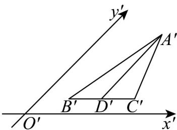

<!-- question-source:start -->
【变式2】如图为水平放置的三角形的直观图， $D^{\phi}$ 是 $\triangle A'B'C'$ 中 $B'C'$ 边的中点，且 $A'D'$ 平行于 $y'$ 轴，那么

$A^{\prime}B^{\prime}$ ， $A^{\prime}D^{\prime}$ ， $A^{\prime}C^{\prime}$ 三条线段对应原图形中线段AB，AD，AC中（）.

A. 最长的是 $AB$ ，最短的是 $AC$ B. 最长的是 $AC$ ，最短的是 $AB$ C. 最长的是 $AB$ ，最短的是 $AD$ D. 最长的是 $AD$ ，最短的是 $AC$
<!-- question-source:end -->

![[高中/课堂同步/题库/人教A版高中数学同步讲义(2026)/02_必修第二册/第八章 立体几何初步/讲义/第八章_立体几何初步_高效培优讲义_/题型02_直观图_sec_19/questions/answers/Q00065328A1.md]]
