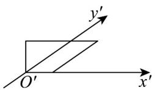
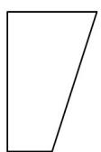
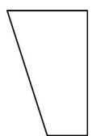
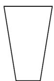
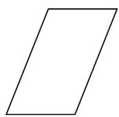
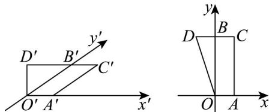

> [!faq]- 《第八章_立体几何初步_高效培优讲义_》官方解析
>
> > [!success]- **【答案】**  A  B  C  D 
>
> > [!note]- **【分析】**
> > 由斜二测画法的规则可知：平行于 $x^{\prime}$ 轴的线在原图中平行于 $x$ 轴，且长度不变，作出原图，即可选
> >
> > 出答案.
>
> > [!note]- **【解析】**
> > 设直观图中与 $x'$ 轴和 $y'$ 轴的交点分别为 $A'$ 和 $B'$ ，
> >
> > 根据斜二测画法的规则在直角坐标系中先做出对应的 A 和 B 点，
> >
> > 再由平行于 $x^{\prime}$ 轴的线在原图中平行于 $x$ 轴，且长度不变，
> >
> > 作出原图得四边形OACD
> >
> > 故选：B.
> >
> > 
