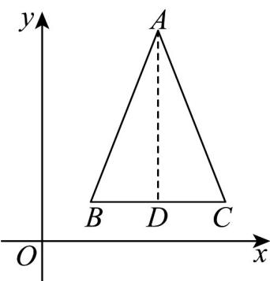

> [!faq]- 《第八章_立体几何初步_高效培优讲义_》官方解析
>
> > [!success]- **【答案】** C
>
> > [!note]- **【分析】**
> > 根据斜二测画法还原平面图形可知结果·
>
> > [!note]- **【解析】**
> > 因为 $A^{\prime}D^{\prime} / / y^{\prime}$ 轴，所以在 $\forall ABC$ 中， $AD \perp BC$
> >
> > 又因为 $D^{\phi}$ 是 $B^{\prime}C^{\prime}$ 的中点，所以 $D$ 是 $BC$ 中点，
> >
> > 
> >
> > 所以 $\vee ABC$ 为等腰三角形，有 $AB = AC > AD$
> >
> > 故选 **C**.
