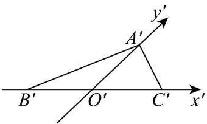
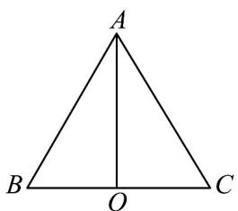

> [!faq]- 《第八章_立体几何初步_高效培优讲义_》官方解析
>
> > [!success]- **【答案】**  A. 等边三角形 B. 直角三角形 C．三边中只有两边相等的等腰三角形 D．三边互不相等的三角形
>
> > [!note]- **【分析】**
> > 根据斜二测画法的规则求解即可·
>
> > [!note]- **【解析】**
> > 由图形知，在原 $\forall ABC$ 中， $AO \perp BC$ ，如图，
> >
> > 
> >
> > 因为 $A^{\prime}O^{\prime} = \frac{\sqrt{3}}{2}$ ，所以 $AO = \sqrt{3}$
> >
> > $$
> > \because B ^ {\prime} O ^ {\prime} = C ^ {\prime} O ^ {\prime} = 1 \quad \therefore B C = 2
> > $$
> >
> > 又 $AB = \sqrt{AO^{2} + BO^{2}} = \sqrt{3 + 1} = 2$ ， $AC = \sqrt{AO^{2} + CO^{2}} = \sqrt{3 + 1} = 2$ .
> >
> > $\therefore^{\triangle}ABC$ 为等边三角形.
> >
> > 故选 **A**
