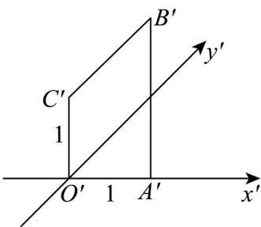
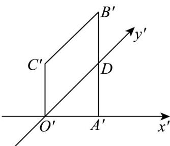
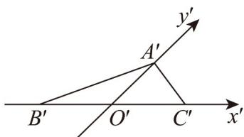
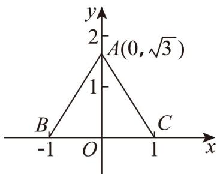

## 题型02 直观图

【典例1】一水平放置的平面四边形 $OABC$ 的直观图 $O'A'B'C'$ 如图所示，其中 $O'A' = O'C' = 1$ ， $O'C' \perp x'$ 轴， $A'B' \perp x'$ 轴， $B'C' // y'$ 轴，则四边形 $OABC$ 的面积为（）

A. $\frac{3\sqrt{2}}{2}$ B. $3\sqrt{2}$ C. 3 D. $\frac{3}{2}$

【答案】B

【分析】结合图形可得 $A^{\prime}B^{\prime}=2$ ，则可得四边形 $O^{\prime}A^{\prime}B^{\prime}C^{\prime}$ 面积，后可得四边形 OABC 的面积。
【详解】设 $y'$ 轴与 $A'B'$ 交点为 D，因 $O'C' \perp x'$ 轴， $A'B' \perp x'$ 轴，则 $O'C' // A'B'$ ，

又 $B^{\prime}C^{\prime} / / y^{\prime}$ 轴，则四边形 $O^{\prime}DB^{\prime}C^{\prime}$ 为平行四边形，故 $DB^{\prime} = O^{\prime}C^{\prime} = 1$ . 又 $\angle x^{\prime}O^{\prime}y^{\prime} = 45^{\circ}$ ，结合 $A^{\prime}B^{\prime}\bot x^{\prime}$ 轴，则 $DA^{\prime} = O^{\prime}A^{\prime} = 1$ ，故 $A^{\prime}B^{\prime} = 2$ . 则四边形 $O^{\prime}A^{\prime}B^{\prime}C^{\prime}$ 面积为 $\frac{1}{2}\times (1 + 2)\times 1 = \frac{3}{2}$ ，

$$
\sqrt {2}
$$

因四边形 $O'A'B'C'$ 面积是四边形OABC的面积的 $\overline{4}$ 倍，

则四边形 $OABC$ 的面积为 $3\sqrt{2}$ .

故选：B

【典例2】把VABC按斜二测画法得到 $\triangle A^{\prime}B^{\prime}C^{\prime}$ ，如图所示，其中 $B^{\prime}O^{\prime}=C^{\prime}O^{\prime}=1$ ， $A^{\prime}O^{\prime}=\frac{\sqrt{3}}{2}$ ，那么VABC是

一个（）

A. 等边三角形 B. 直角三角形 C. 等腰三角形 D. 三边互不相等的三角形

【答案】A

【分析】根据斜二侧画法还原 $\vee ABC$ 在直角坐标系的图形，进而分析出 $\vee ABC$ 的形状.

【详解】根据斜二侧画法还原 $\vee ABC$ 在直角坐标系的图形，如下图所示：

由图得 $AO = \sqrt{3}$ ， $AB = AC = \sqrt{\left(\sqrt{3}\right)^2 + 1^2} = 2 = BC$ ，故 $\bigvee ABC$ 为等边三角形，

故选：A

## 方法技巧

斜二测法下的直观图与原图面积之间存在固定的比值关系： $S_{\text{直}} = \frac{\sqrt{2}}{4} S_{\text{原}}$

![[高中/课堂同步/题库/人教A版高中数学同步讲义(2026)/02_必修第二册/第八章 立体几何初步/讲义/第八章_立体几何初步_高效培优讲义_/题型02_直观图_sec_19/questions/Q00065327.md]]
![[高中/课堂同步/题库/人教A版高中数学同步讲义(2026)/02_必修第二册/第八章 立体几何初步/讲义/第八章_立体几何初步_高效培优讲义_/题型02_直观图_sec_19/questions/Q00065328.md]]
![[高中/课堂同步/题库/人教A版高中数学同步讲义(2026)/02_必修第二册/第八章 立体几何初步/讲义/第八章_立体几何初步_高效培优讲义_/题型02_直观图_sec_19/questions/Q00065329.md]]
