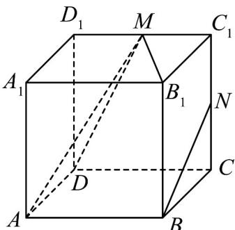

<!-- question-source:start -->
【变式3】如图，在正方体 $ABCDA_{1}B_{1}C_{1}D_{1}$ 中，M，N 分别为棱 $C_{1}D_{1}$ ， $CC_{1}$ 的中点，以下四个结论：

①直线 DM 与 $CC_{l}$ 是相交直线；

②直线 $AM$ 与 $NB$ 是平行直线；

③直线 BN 与 $MB_{1}$ 是异面直线；

④直线 AM 与 $DD_{1}$ 是异面直线·

其中正确的为\_\_\_\_(把你认为正确的结论的序号都填上).
<!-- question-source:end -->

![[高中/课堂同步/题库/人教A版高中数学同步讲义(2026)/02_必修第二册/第八章 立体几何初步/讲义/第八章_立体几何初步_高效培优讲义_/题型05_异面直线的判定_sec_21/questions/answers/Q00065338A1.md]]
