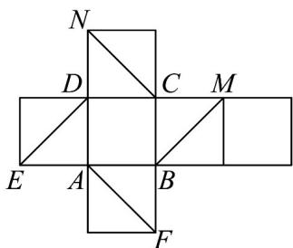
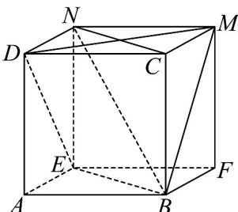

> [!faq]- 《第八章_立体几何初步_高效培优讲义_》官方解析
>
> > [!success]- **【答案】**  A. BM 与 ED 平行 B. $CN \perp AF$ C. CN 与 BM 成 $60^{\circ}$ D．四条直线 AF、BM、CN、DE 中任意两条都是异面直线
>
> > [!note]- **【分析】**
> > 还原成正方体之后根据正方体性质分析线线位置关系·
>
> > [!note]- **【解析】**
> > 根据展开图还原正方体如图所示：
> >
> > 
> >
> > $BM$ 与 $ED$ 不平行，所以 $\mathsf{A}$ 错误；
> >
> > 正方体中 $CN \perp DM$ ， $DM \parallel FA$ ，所以 $CN \perp AF$ ，所以 B 正确；
> >
> > $CN//EB$ ，CN与BM成角就是 $\angle EBM$ ， $\triangle EBM$ 是等边三角形，所以 $\angle EBM=60^{\circ}$ ，所以C正确；
> >
> > 由图可得四条直线 AF 、 BM 、 CN 、 DE 中任意两条既不相交也不平行，所以任意两条都是异面直线·
