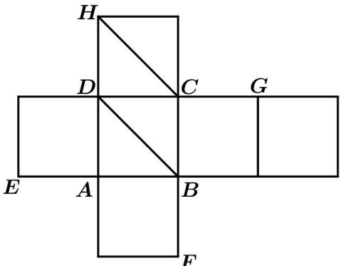
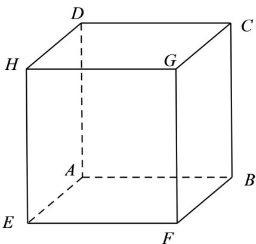

> [!faq]- 《第八章_立体几何初步_高效培优讲义_》官方解析
>
> > [!success]- **【答案】**  A. E, H, C, B 四点共面 B. $BD$ 与 $CH$ 是异面直线 C. $V_{F-BEG} = \frac{8}{3}$ D．该正方体外接球的体积为 $12\pi$
>
> > [!note]- **【分析】**
> > 把展开图复原成正方体，确定点的位置，再根据正方体的性质计算判断.
>
> > [!note]- **【解析】**
> > 把展开图复原成正方体同，八个顶点位置如图，由正方体性质，
> >
> > HE // BC，A 正确；
> >
> > $BD \subset$ 平面 $ABCD$ ， $C \in$ 平面 $ABCD$ ， $H \notin$ 平面 $ABCD$ ， $C \notin BD$ ，所以 $CH$ 与 $BD$ 是异面直线， $^{B}$ 正确；
> >
> > $V_{F - BEG} = V_{G - BEF} = \frac{1}{3}\times S_{\triangle BEF}\times GF = \frac{1}{3}\times \frac{1}{2}\times 2\times 2\times 2 = \frac{4}{3}$ C错；
> >
> > 正方体的对角线长为 $2\sqrt{3}$ ，即外接球半径为 $R = \sqrt{3}$ ，所以球体积为 $V = \frac{4}{3} p R^3 = \frac{4}{3} p (\sqrt{3})^3 = 4\sqrt{3} p$ ，D 错。
> >
> > 故选：CD.
> >
> > 
