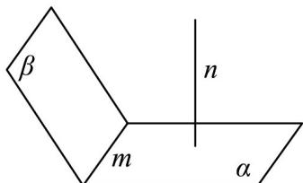
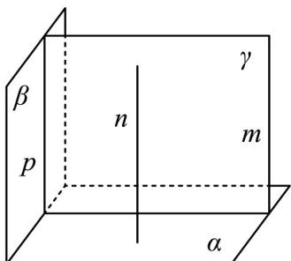

## 题型06 平行与垂直的判定

【典例1】可以用集合语言将“公理 $^{1}$ ：如果直线l上有两个点在平面 $\alpha$ 上，那么直线l在平面 $\alpha$ 上。”表述为（

)

A. $A \subset l$ , $B \subset l$ 且 $A \subset \alpha$ , $B \subset \alpha$ , 则 $l \subset \alpha$

B．若 $A \in l$ ， $B \in l$ 且 $A \in \alpha$ ， $B \in \alpha$ ，则 $l \in \alpha$

C. 若 $A \in l$ ， $B \in l$ 且 $A \in \alpha$ ， $B \in \alpha$ ，则 $l \subset \alpha$

D．若 $A \in l$ ， $B \in l$ 且 $A \subset \alpha$ ， $B \subset \alpha$ ，则 $l \in \alpha$

【答案】C

【分析】根据点、线、面位置关系的符号语言可得结果·

【详解】在空间几何中，点可以看成是元素，线和面应看成是集合，

根据元素属于集合，子集包含于全集可得：

公理 $^{1}$ ：如果直线 l 上有两个点在平面 $\alpha$ 上，那么直线 l 在平面 $\alpha$ 上，用集合语言应表示为：

若 $A \in l$ ， $B \in l$ 且 $A \in \alpha$ ， $B \in \alpha$ ，则 $l\ddot{\mathrm{O}}\alpha$

故选：C.

【典例2】对于直线 $m$ 、 $n$ 和平面 $\alpha$ 、 $\beta$ ，能得出 $\alpha \perp \beta$ 的一个条件是（ ）A. $m\perp n$ ， $m / /\alpha$ ， $n / /\beta$ B. $m\perp n$ ， $\alpha \cap \beta = m$ ， $n\perp \alpha$ C. $m / / n$ ， $n\perp \alpha$ ， $m / /\beta$ D. $m / / n$ ， $m\perp \alpha$ ， $n\perp \beta$

【答案】C

【分析】利用平面垂直判定定理，逐一分析各选项中直线与平面的关系是否可以推导出 $\alpha \perp \beta$

【详解】对于 $^{A}$ ，当m,n垂直相交且同时平行于 $\alpha,\beta$ 时，可能有 $\alpha//\beta$ 的情况，所以 $^{A}$ 错误；

对于 $^{B}$ ，如下图，当 $m \perp n$ ， $\alpha \cap \beta = m$ ， $n \perp \alpha$ ，不一定得到 $\alpha \perp \beta$ ，所以 $^{B}$ 错误；

对于 C，过直线 m 作平面 $\gamma$ 与平面 $\beta$ 交于直线 p，如下图，

$$
\therefore m / / \beta , m \subset \gamma , \beta \cap \gamma = p, \therefore m / / p,
$$

$$
\because m / / n, n \perp \alpha , \therefore m \perp \alpha , \therefore p \perp \alpha ,
$$

又 $p \subset \beta$ ，从而得到 $\alpha \perp \beta$ ，故 C 正确；

对于 D，由 $m \parallel n$ ， $m \perp \alpha$ 可得 $n \perp \alpha$ ，而 $n \perp \beta$ ，故可得 $\alpha \parallel \beta$ ，即 D 错误。

故选：C.

## 方法技巧

排除法：画一个正方体，在正方体内部或表面找线或面进行排除。

![[高中/课堂同步/题库/人教A版高中数学同步讲义(2026)/02_必修第二册/第八章 立体几何初步/讲义/第八章_立体几何初步_高效培优讲义_/题型06_平行与垂直的判定_sec_22/questions/Q00065339.md]]
![[高中/课堂同步/题库/人教A版高中数学同步讲义(2026)/02_必修第二册/第八章 立体几何初步/讲义/第八章_立体几何初步_高效培优讲义_/题型06_平行与垂直的判定_sec_22/questions/Q00065340.md]]
![[高中/课堂同步/题库/人教A版高中数学同步讲义(2026)/02_必修第二册/第八章 立体几何初步/讲义/第八章_立体几何初步_高效培优讲义_/题型06_平行与垂直的判定_sec_22/questions/Q00065341.md]]
