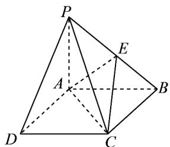

<!-- question-source:start -->
【变式1】如图在四棱锥P-ABCD中，PA⊥底面ABCD，且底面ABCD是平行四边形·已知PA=AB=2

$AD=\sqrt{5}$ ，AC=1，E是PB中点·

(1)求证： $PD \parallel$ 平面 $ACE$ ；

(2)求四面体 P-ACE 的体积.
<!-- question-source:end -->

![[高中/课堂同步/题库/人教A版高中数学同步讲义(2026)/02_必修第二册/第八章 立体几何初步/讲义/第八章_立体几何初步_高效培优讲义_/题型07_线面平行处理技巧_sec_23/questions/answers/Q00065342A1.md]]
