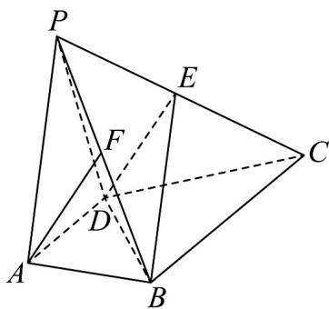

<!-- question-source:start -->
【变式2】如图，四棱锥 $P - ABCD$ 中， $AD // BC$ ， $AD = \frac{1}{2} BC$ ，点 $E$ 为 $PC$ 上一点， $F$ 为 $PB$ 的中点，且 $AF //$ 平面 $BDE$ .

(1)若平面 PAD 与平面 PBC 的交线为 l，求证： $l \parallel$ 平面 ABCD；

(2)求证： $AF \parallel DE$ .
<!-- question-source:end -->

![[高中/课堂同步/题库/人教A版高中数学同步讲义(2026)/02_必修第二册/第八章 立体几何初步/讲义/第八章_立体几何初步_高效培优讲义_/题型07_线面平行处理技巧_sec_23/questions/answers/Q00065343A1.md]]
