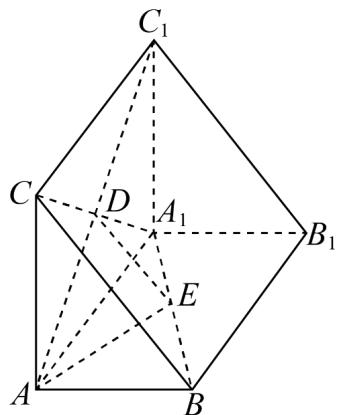

<!-- question-source:start -->
【变式2】如图，在三棱柱 $ABC - A_{1}B_{1}C_{1}$ 中，平面 $ABB_{1}A_{1}\perp$ 平面 $AA_{1}C_{1}C$ ，四边形 $AA_{1}C_{1}C$ 是正方形，四边形

$ABB_{1}A_{1}$ 是矩形， $A_{1}C\cap AC_{1}=D$ ，E 是 $A_{1}B$ 的中点.

(1)证明： $DE \parallel$ 平面 ABC；

(2)若 $AA_{1} = 2AB = 4$ ，求点 $A$ 到平面 $A_{1}DE$ 的距离
<!-- question-source:end -->

![[高中/课堂同步/题库/人教A版高中数学同步讲义(2026)/02_必修第二册/第八章 立体几何初步/讲义/第八章_立体几何初步_高效培优讲义_/题型08_证明线线垂直_sec_24/questions/answers/Q00065346A1.md]]
