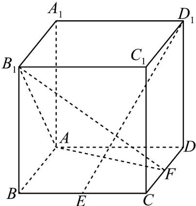

<!-- question-source:start -->
【变式3】如图所示，在棱长为 $^{1}$ 的正方体 $ABCDA_{1}B_{1}C_{1}D_{1}$ 中，点E是棱BC的中点，点F是棱CD上的动点.

试确定点 $F$ 的位置，使得 $D_{l}E^{\perp}$ 平面 $AB_{l}F$ .

<!-- question-source:end -->

![[高中/课堂同步/题库/人教A版高中数学同步讲义(2026)/02_必修第二册/第八章 立体几何初步/讲义/第八章_立体几何初步_高效培优讲义_/题型08_证明线线垂直_sec_24/questions/answers/Q00065347A1.md]]
