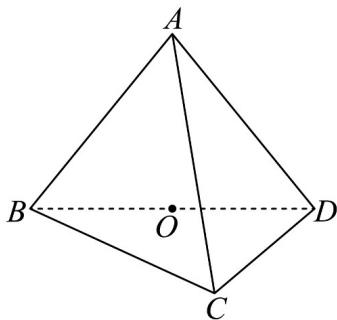
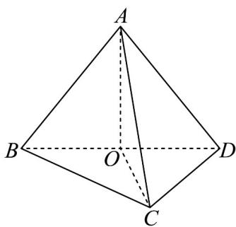
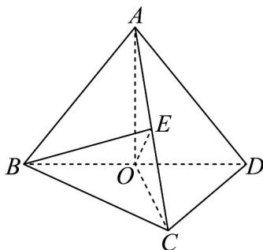
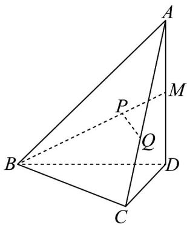
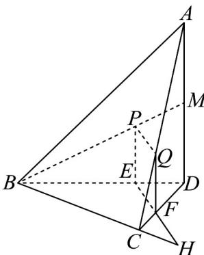
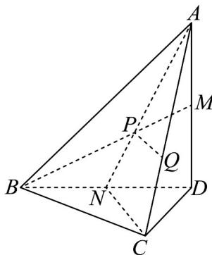
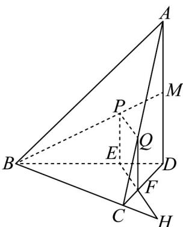

## 题型08 证明线线垂直

【典例1】如图，已知三棱锥 $A - BCD$ ， $\triangle ABD$ 为等边三角形， $BD = AC$ ， $BC\perp CD$ ，点 $O$ 为 $BD$ 的中点·

(1)证明： $AO \perp OC$ ；

(2) 当 $BC = CD$ 时，取 $AC$ 的中点 $E$ ，求 $BE$ 与平面 $AOC$ 所成角的余弦值；

【答案】(1)证明见解析

(2) $\frac{\sqrt{2}}{2}$

【分析】（ $^{1}$ ）由勾股定理逆定理证明即可；

(2) 由线面角的定义说明 $\angle BEO$ 为 $BE$ 与平面 $AOC$ 所成角，结合解三角形知识求解即可.

【详解】（1）设等边三角形 $\triangle ABD$ 的边长 $2a(a > 0)$ ，连接 $AO$ 、 $OC$ ，

因为点 O 为 BD 的中点·

则 $AO = \sqrt{(2a)^2 - a^2} = \sqrt{3} a$

因为 $BC \perp CD$ ，所以 $OC = \frac{1}{2} BD = a$ ，又 AC = BD = 2a，

所以 $AO^{2} + CO^{2} = AC^{2}$ ，所以 $AO \perp OC$ ；

(2) 因为 $BC = CD$ ，所以 $CO \perp BD$ ，又 $AO \cap CO = O$ ， $AO, CO \subset$ 平面 $AOC$

所以 $BD \perp$ 平面 $AOC$ ，连接 $OE$ ，则 $\angle BEO$ 为 $BE$ 与平面 $AOC$ 所成角，

又 $OE \subset$ 平面 $AOC$ ，所以 $BD \perp OE$

又 $OE = \frac{1}{2} AC = a$ ， $OB = a$ ，所以 $\triangle BOE$ 为等腰直角三角形，所以 $\angle BEO = \frac{\pi}{4}$

所以 $\cos\angle BEO=\frac{\sqrt{2}}{2}$ ，即 BE 与平面 AOC 所成角的余弦值为 $\frac{\sqrt{2}}{2}$ ;

【典例2】如图，在三棱锥 $A - BCD$ 中， $BC \perp CD, \angle BDC = 60^{\circ}$ ， $M$ 是 $AD$ 的中点，点 $P, Q$ 分别在线段 $BM, AC$ 上，且 $BP = 2PM, AQ = 2QC$

(1)求证： $PQ \parallel$ 平面 BCD；

(2)求异面直线 $BC$ 与 $PQ$ 所成角的大小.

【答案】(1)证明见解析

(2) $30^{\circ}$

【分析】（1）法一：在线段 $BD$ 上取一点 $E$ ，使得 $BE = 2ED$ ，连接 $PE$ ，可证四边形 $PEFQ$ 为平行四边形，

进而得 $PQ//EF$ ，可得结论；

法二：连接 $AP$ 并延长交 $BD$ 于点 $N$ ，连接 $NC$ ，利用中位线定理可得 $PQ//NC$ ，可证结论；

(2) 法一：设 CD = t，则 BD = 2t，延长 EF, BC 交于点 H，可得 $\angle BHE$ 即为异面直线 BC 与 PQ 所成的角，

求解即可.

法二：由（1）可得 $\angle BCN$ 即为异面直线 $BC$ 与 $PQ$ 所成的角，进而求解即可·

【详解】（1）法一：如图，在线段 $BD$ 上取一点 $E$ ，使得 $BE = 2ED$ ，连接 $PE$ ：

由已知 $BP = 2PM$ 得 $PE // MD$ ，且 $PE = \frac{2}{3} MD = \frac{2}{3} \times \frac{1}{2} AD = \frac{1}{3} AD$

在线段 $CD$ 上取一点 $F$ ，使得 $DF = 2FC$ ，连接 $FE, QF$

由已知 $AQ = 2QC$ 得 $QF / / AD$ ，且 $QF = \frac{1}{3} AD$

所以 $PE = QF$ ，且 $PE // QF$ ，因此四边形 $PEFQ$ 为平行四边形，

所以 $PQ//EF$ ，又 $PQ\not\subset$ 平面 $BCD$ ， $EF\subset$ 平面 $BCD$ ，所以 $PQ//$ 平面 $BCD$

法二：如图，连接 $AP$ 并延长交 $BD$ 于点 $N$ ，连接 $NC$

因为 M 是 AD 的中点，且 $BP = 2PM$ ，所以 P 是 $\triangle ABD$ 的重心，

所以 $N$ 是 $BD$ 的中点， $AP = 2PN$

又因为 AQ = 2QC ，所以 PQ // NC ，

又 $NC \subset$ 平面 $BCD$ ， $PQ \notin$ 平面 $BCD$ ，所以 $PQ //$ 平面 $BCD$

(2) 法一：由 $BC \perp CD, \angle BDC = 60^{\circ}$ ，不妨设 $CD = t$ ，则 $BD = 2t$

延长 $EF, BC$ 交于点 $H$ ，由（1）知， $PQ//EF$ ，

如图，则 $\angle BHE$ 即为异面直线 $BC$ 与 $PQ$ 所成的角.

由（1）知 $DE = \frac{1}{3} BD = \frac{2t}{3}, DF = \frac{2}{3} CD = \frac{2t}{3}$

所以 $\triangle DEF$ 为等边三角形，即 $\angle EFD = \angle CFH = 60^{\circ}$ ，从而 $D B H E = 30^{\circ}$

即异面直线 $BC$ 与 $PQ$ 所成角的大小为 $30^{\circ}$

法二：由（1）知 $N$ 是 $BD$ 的中点，且 $PQ//NC$

则 $\angle B C N$ 即为异面直线 $B C$ 与 $P Q$ 所成的角.

因为 $BC \perp CD, \angle BDC = 60^{\circ}$ ，N 是 BD 的中点，所以 $\triangle CDN$ 为等边三角形，

从而 $\angle BCN = 30^{\circ}$ ，

即异面直线 $BC$ 与 $PQ$ 所成角的大小为 $30^{\circ}$

## 方法技巧

证明 $l_{1}\perp l_{2}\xrightarrow{先看两直线位置关系} \left\{\begin{array}{l} 共面 \Rightarrow \left\{\begin{array}{l} 三线合一(有等腰三角形就必用)\\ 勾股定理(题目中线段数据多)\\ 其他(初中平面几何学习的其他垂直证明方法)\end{array}\right. \\ 异面 \Rightarrow 考虑用线面垂直推导异面垂直 \Rightarrow 找重垂线 \Rightarrow 在重垂线对应平面内找垂直\end{array}\right.$

![[高中/课堂同步/题库/人教A版高中数学同步讲义(2026)/02_必修第二册/第八章 立体几何初步/讲义/第八章_立体几何初步_高效培优讲义_/题型08_证明线线垂直_sec_24/questions/Q00065345.md]]
![[高中/课堂同步/题库/人教A版高中数学同步讲义(2026)/02_必修第二册/第八章 立体几何初步/讲义/第八章_立体几何初步_高效培优讲义_/题型08_证明线线垂直_sec_24/questions/Q00065346.md]]
![[高中/课堂同步/题库/人教A版高中数学同步讲义(2026)/02_必修第二册/第八章 立体几何初步/讲义/第八章_立体几何初步_高效培优讲义_/题型08_证明线线垂直_sec_24/questions/Q00065347.md]]
