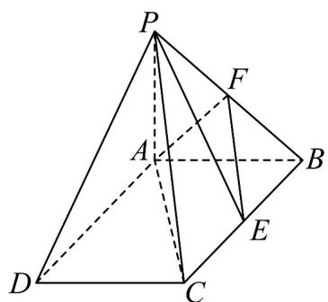

<!-- question-source:start -->
【变式3】如图， $PA \perp$ 平面ABCD，四边形ABCD是矩形，PA = AB = 1，点F是PB的中点，点E在边BC

上移动·

(1)当点 $E$ 为 $BC$ 的中点时，试判断 $EF$ 与平面 $PAC$ 的位置关系，并说明理由；

(2)证明：无论点 $E$ 在边 $BC$ 的何处，都有 $PE \perp AF$ .
<!-- question-source:end -->

![[高中/课堂同步/题库/人教A版高中数学同步讲义(2026)/02_必修第二册/第八章 立体几何初步/讲义/第八章_立体几何初步_高效培优讲义_/题型09_证明线面垂直_sec_25/questions/answers/Q00065350A1.md]]
