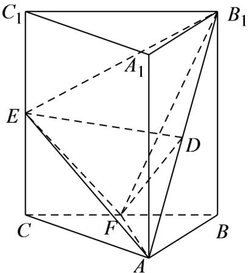

> [!faq]- 《第八章_立体几何初步_高效培优讲义_》官方解析
>
> > [!success]- **【答案】** (1)证明见解析 (2) $\frac{1}{16}a^{3}$
>
> > [!note]- **【分析】**
> > （1）依题意可得 $B_{1}B \perp$ 平面 $ABC$ ，即可得到 $B_{1}B \perp AF$ ，再由 $BC \perp AF$ ，从而得到 $AF \perp$ 平面 $BB_{1}C_{1}C$ ，即可得到 $AF \perp B_{1}F$ ，再利用勾股定理逆定理得到 $EF \perp B_{1}F$ ，即可得证；
> >
> > $V_{D-AEF}=\frac{1}{2}V_{B_{1}-AEF}$ ，根据锥体的体积公式计算可得
>
> > [!note]- **【解析】**
> > （1）证明：在三棱柱 $ABC-A_{1}B_{1}C_{1}$ 中， $A_{1}A//B_{1}B$ ，
> >
> > 因为 $A_{1}A \perp$ 平面 ABC ，所以 $B_{1}B \perp$ 平面 ABC .
> >
> > 又 $AF \subset$ 平面 ABC ，所以 $B_{1}B \perp AF$ ，①
> >
> > 因为 BA = CA ，F 为 BC 中点，所以 $BC \perp AF$ ，②
> >
> > 由①② $B_{1}B \cap BC = B$ ， $B_{1}B$ ， $BC \subset$ 平面 $BB_{1}C_{1}C$ ，所以 $AF \perp$ 平面 $BB_{1}C_{1}C$
> >
> > 又 $B_{1}F \subset$ 平面 $BB_{1}C_{1}C$ ，所以 $AF \perp B_{1}F$ ，③
> >
> > 设 AB = a ，则在矩形 $BB_{1}C_{1}C$ 中， $BC = \sqrt{2}a$ ， $BB_{1} = CC_{1} = AA_{1} = a$ ，
> >
> > $$
> > E F = \sqrt {E C ^ {2} + C F ^ {2}} = \frac {\sqrt {3}}{2} a, B _ {1} F = \sqrt {B F ^ {2} + B B _ {1} ^ {2}} = \frac {\sqrt {6}}{2} a, B _ {1} E = \sqrt {E C _ {1} ^ {2} + C _ {1} B _ {1} ^ {2}} = \frac {3}{2} a
> > $$
> >
> > 所以 $EF^{2} + B_{1}F^{2} = B_{1}E^{2}$ ，即 $EF \perp B_{1}F$ ，④
> >
> > 由③④ $EF \cap AF = F$ ，EF， $AF \subset$ 平面AEF，
> >
> > 所以 $B_{1}F \perp$ 平面 AEF .
> >
> > (2) 因为 D 为 $B_{1}A$ 中点，所以 $V_{D-AEF} = \frac{1}{2} V_{B_{1}-AEF}$
> >
> > $$
> > = \frac {1}{2} \times \frac {1}{3} \times B _ {1} F \times S _ {\triangle A E F} = \frac {1}{2} \times \frac {1}{3} \times \frac {\sqrt {6} a}{2} \times \frac {1}{2} \times \frac {\sqrt {2} a}{2} \times \frac {\sqrt {3} a}{2} = \frac {1}{1 6} a ^ {3}
> > $$
> >
> > 
