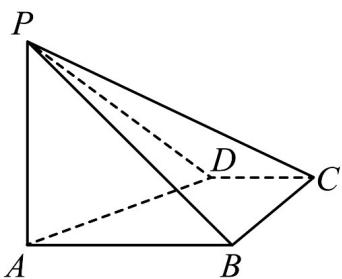
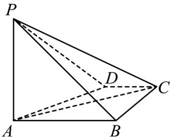
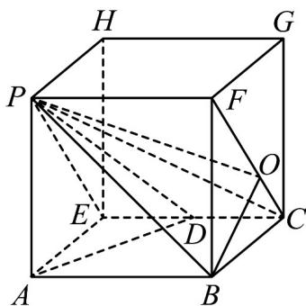
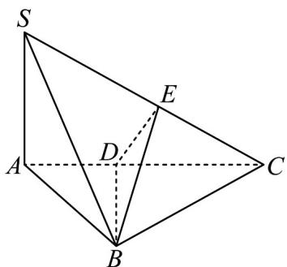
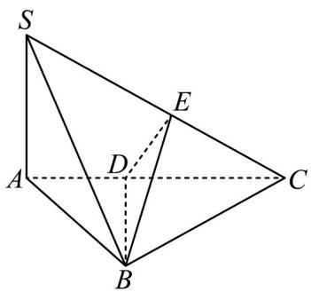

## 题型09 证明线面垂直

【典例1】从① $CD \perp BC$ ，② $CD //$ 平面PAB这两个条件中选一个，补充在下面问题中，并完成解答·

如图，在四棱锥 P-ABCD 中， $PA \perp$ 平面 ABCD，PA = AB = 2，BC = CD = 1，PC = 3，\_\_\_\_。

(1)求证：四边形ABCD是直角梯形；

(2)求直线 PB 与平面 PCD 所成角的正弦值.

【答案】(1)证明见解析

(2) $\frac{\sqrt{10}}{10}$

【分析】（1）利用线面垂直的性质得 $PA \perp AC$ ，再利用勾股定理的逆定理得 $AB \perp BC$ ，最后证得 $AB // CD$

且 $AB \neq CD$ ，则证明四边形 $ABCD$ 是直角梯形；

(2) 将四棱锥 P-ABCD 补成一个长方体 ABCE-PFGH，再过 B 作 $BO \perp CF$ 于 O，连接 OP，利用线面垂直

的判定定理得 $OB \perp$ 平面 PFCE，则转化为求 $\angle BPO$ 的正弦值，再分别求出 OB, PB 的长即可.

【详解】（1）选择①·证明：连接 $AC$ ，因为 $PA \perp$ 平面 $ABCD$ ， $AC \subset$ 平面 $ABCD$ ，所以 $PA \perp AC$

因为 PA = 2 ， PC = 3 ，所以 $AC^{2} = PC^{2} - PA^{2} = 5$

因为 AB = 2，BC = 1，所以 $AB^{2} + BC^{2} = AC^{2}$ ，

所以 $AB \perp BC$ .

因为 $CD \perp BC$ ，所以 $AB \parallel CD$ ，

又 $AB \neq CD$ ，所以四边形 ABCD 是直角梯形.

选择②·证明：连接AC，

因为 $PA \perp$ 平面 ABCD， $AC \subset$ 平面 ABCD，所以 $PA \perp AC$ .

因为 PA = 2 ， PC = 3 ，所以 $AC^{2} = PC^{2} - PA^{2} = 5$

因为 AB = 2，BC = 1，所以 $AB^{2} + BC^{2} = AC^{2}$

所以 $AB \perp BC$ .

因为 $CD / /$ 平面 $PAB$ ， $CD \subset$ 平面 $ABCD$ ，平面 $PAB \cap$ 平面 $ABCD = AB$

所以 $AB \parallel CD$ ，又 $AB \neq CD$ ，所以四边形 ABCD 是直角梯形。

(2) 选择①②相同，

如图，延长 $CD$ 到 $E$ 使 $DE = CD$ ，则四边形 $ABCE$ 为矩形，将四棱锥 $P - ABCD$ 补成一个长方体 $ABCE - PFGH$

连接 $PE$ ， $CF$ ，则 $PB$ 与平面 $PCD$ 所成的角即 $PB$ 与平面 $PFCE$ 所成的角

过 B 作 $BO \perp CF$ 于 O，连接 OP，由长方体的性质知， $EC \perp$ 平面 BCGF，

因为 $OB \subset$ 平面 BCGF，所以 $EC \perp OB$ ，又 $CF \cap EC = C$ ， $CF, EC \subset$ 平面 PFCE，

所以 $OB \perp$ 平面 PFCE，则 $\angle BPO$ 即为直线 PB 与平面 PCD 所成的角.

在 $Rt\triangle CBF$ 中， $CF = \sqrt{2^2 + 1^2} = \sqrt{5}$ ，可求得 $OB = \frac{2}{\sqrt{5}} = \frac{2\sqrt{5}}{5}$

在 $Rt\triangle PAB$ 中，可求得 $PB = \sqrt{2^{2} + 2^{2}} = 2\sqrt{2}$ ，

所以 $\sin\angle BPO=\frac{OB}{PB}=\frac{\frac{2\sqrt{5}}{5}}{2\sqrt{2}}=\frac{\sqrt{10}}{10}$ .

【典例2】如图，在三棱锥 $S - ABC$ 中， $SA \perp$ 底面 $ABC$ ， $AB \perp BC$ ， $DE$ 垂直平分 $SC$ 且分别交 $AC, SC$ 于点

$D, E$ ，又 $SA = AB, SB = BC$ ，求二面角 $E - BD - C$ 的大小。

【答案】 $60^{\circ}$

【分析】根据题意证得 $BD \perp DE, BD \perp DC$ ，得到 $\angle EDC$ 是所求二面角的平面角，由 $SA \perp$ 底面 $ABC$ ，得到

$SA \perp AB, SA \perp AC$ ，设 $SA = 2$ ，结合 $AB \perp BC$ ，求得 $\angle ACS = 30^{\circ}$ ，进而得到 $\angle EDC = 60^{\circ}$ ，即可求解。

【详解】因为 SB = BC 且 E 是 SC 的中点，所以 BE 是等腰 $\triangle SBC$ 底边 SC 的中线，可得 $SC \perp BE$ ，

又因为 $SC \perp DE, BE \cap DE = E$ ，且 $BE, DE \subset$ 平面 BDE，

所以 $SC \perp$ 平面 BDE ，所以 $SC \perp BD$

因为 $SA \perp$ 平面 ABC ， $BD \subset$ 平面 ABC ，所以 $SA \perp BD$

又因为 $SC \cap SA = A$ 且 $SC, SA \subset$ 平面 SAC ，所以 $BD \perp$ 平面 SAC ，

因为平面 $SAC \cap$ 平面 BDE = DE ，平面 $SAC \cap$ 平面 BDC = DC ，

所以 $BD \perp DE, BD \perp DC$ ，所以 $\angle EDC$ 是所求二面角的平面角，

因为 $SA \perp$ 底面 ABC ，且 $AB, AC \subset$ 底面 ABC ，所以 $SA \perp AB, SA \perp AC$

设 $SA = 2$ ，则 $AB = 2, BC = SB = 2\sqrt{2}$

因为 $AB \perp BC$ ，可得 $AC = 2\sqrt{3}$ ，所以 $\angle ACS = 30^{\circ}$ ，

又由 $DE \perp SC$ ，所以 $\angle EDC = 60^{\circ}$ ，即所求的二面角等于 $60^{\circ}$

## 方法技巧

垂直关系中线面垂直是重点.

①垂直两条相交线；

②垂直里面作垂线；

## 线垂面哪里找

③直（正）棱柱的侧棱是垂线；

④正棱锥的顶点与底面的中心的连线是垂线.

①垂直面里所有线（证线线垂直）；

线垂面有何用 ②过垂线作垂面（证面面垂直）.

证明线面垂直常用两种方法.

方法一：线面垂直的判定。

线线垂直 $\Rightarrow$ 线面垂直，符号表示为： $a\perp b,a\perp c,b\subset \alpha ,c\subset \alpha ,b\cap c = P$ ，那么 $a\perp \alpha$ ：

方法二：面面垂直的性质。

面面垂直 $\Rightarrow$ 线面垂直，符号表示为： $\alpha \perp \beta, \alpha \cap \beta = b, a \subset \alpha, a \perp b$ ，那么 $a \perp \beta$ 。

![[高中/课堂同步/题库/人教A版高中数学同步讲义(2026)/02_必修第二册/第八章 立体几何初步/讲义/第八章_立体几何初步_高效培优讲义_/题型09_证明线面垂直_sec_25/questions/Q00065348.md]]
![[高中/课堂同步/题库/人教A版高中数学同步讲义(2026)/02_必修第二册/第八章 立体几何初步/讲义/第八章_立体几何初步_高效培优讲义_/题型09_证明线面垂直_sec_25/questions/Q00065349.md]]
![[高中/课堂同步/题库/人教A版高中数学同步讲义(2026)/02_必修第二册/第八章 立体几何初步/讲义/第八章_立体几何初步_高效培优讲义_/题型09_证明线面垂直_sec_25/questions/Q00065350.md]]
