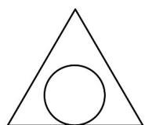
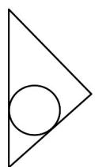
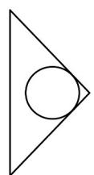
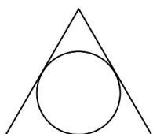

<!-- question-source:start -->
【变式1】一个三棱锥的各棱长均相等，其内部有一个内切球，即球与三棱锥的各面均相切（球在三棱锥的

内部，且球与三棱锥的各面只有一个交点），过一条侧棱和对边的中点作三棱锥的截面，所得截面是下列图

形中的（）

A

B

C

D

<!-- question-source:end -->

![[高中/课堂同步/题库/人教A版高中数学同步讲义(2026)/02_必修第二册/第八章 立体几何初步/讲义/第八章_立体几何初步_高效培优讲义_/题型_03_证明_点共面___线共面_或_点共线__sec_20/questions/answers/Q00065333A1.md]]
