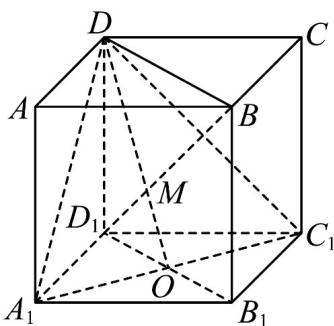

> [!faq]- 《第八章_立体几何初步_高效培优讲义_》官方解析
>
> > [!success]- **【答案】** 2:1
>
> > [!note]- **【分析】**
> > 由平面的基本性质确定 M 是 $BD_{1}$ 与 DO 的交点，进而利用平行线分线段成比例即可得解。
>
> > [!note]- **【解析】**
> > 连接 $B_{1}D_{1}$ 交 $A_{1}C_{1}$ 于O，连接BD、DO
> >
> > <!-- source-part:2 pages:51-100 -->
> >
> > 
> >
> > 由 $M \in BD_{1}$ ， $BD_{1} \subset$ 面 $BDD_{1}B_{1}$ ，则 $M \in$ 面 $BDD_{1}B_{1}$
> >
> > 又 $M \in$ 面 $A_{1}C_{1}D$ ，而面 $BDD_{1}B_{1} \cap$ 面 $A_{1}C_{1}D = DO$ ，故 $M \in DO$ ，
> >
> > 所以 $M$ 是 $BD_{1}$ 与 $DO$ 的交点，又 $B_{1}D_{1} // BD$
> >
> > 所以 $\frac{BM}{MD_1} = \frac{BD}{D_1O} = \frac{BD}{\frac{1}{2}B_1D_1} = 2$
> >
> > 所以 $BM:MD_{1}=2:1$ .
> >
> > 故答案为：2:1.
