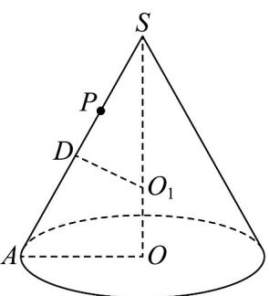
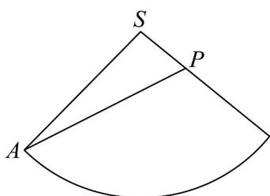
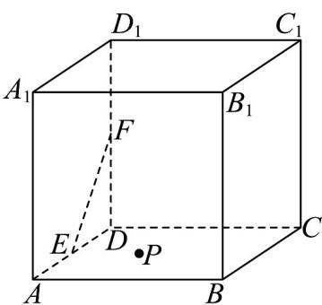
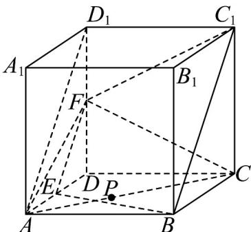
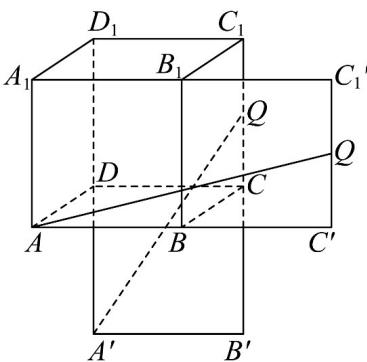

> [!faq]- 《第八章_立体几何初步_高效培优讲义_》官方解析
>
> > [!success]- **【答案】** $\gamma$ ，则平面 $\gamma$ ， $\beta$ 的交线必过（）  A.点 $A$ B.点 $B$ C.点 $C$ D.点 $D$
>
> > [!note]- **【分析】**
> > 根据平面的基本性质判断·
>
> > [!note]- **【解析】**
> > 因为 $A \in \alpha, A \in \gamma, B \in \alpha, B \in \gamma, C \in \beta, C \in \gamma, D \in \beta, D \in \gamma$
> >
> > 所以点 A 在 $\alpha$ 与 $\gamma$ 的交线上，点 B 在 $\alpha$ 与 $\gamma$ 的交线上，点 C 在 $\beta$ 与 $\gamma$ 的交线上，点 D 在 $\beta$ 与 $\gamma$ 的交线上，
> > 故选：CD
> >
> > 题型04 截面问题
> >
> > 【典例1】已知圆锥 $SO$ 的侧面积为 $3\pi$ ，母线 $SA = l$ ，底面圆的半径为 $r$ ，点 $P$ 满足 $AP = 2PS$ ，则（）
> >
> > A. 当 $r = 1$ 时，圆锥 $SO$ 的体积为 $\frac{2\sqrt{2}\pi}{3}$ B. 当 $r = 1$ 时，从点 $A$ 绕圆锥一周到达点 $P$ 的最短长度为 $\sqrt{13}$ C. 当 $r = \frac{2}{3}$ 时，顶点S和两条母线构成的截面三角形的最大面积为 $\frac{3\sqrt{7}}{4}$ D. 当 $r = \frac{2}{3}$ 时，棱长为 $\frac{\sqrt{2}}{2}$ 的正四面体在圆锥 $SO$ 内可以任意转动
> >
> > 【答案】ABD
> >
> > 【分析】根据圆锥侧面积及体积公式计算可判断 $^{A}$ ，将侧面展开，利用弧长公式结合余弦定理计算可判断
> >
> > B，利用三角形面积公式计算可判断C，通过比较圆锥内切球半径和正四面体外接球半径的大小，可判断D.
> > 【详解】由题意，圆锥SO的侧面积 $S=\pi rl=3\pi$ ，所以rl=3.
> >
> > 
> > 图1
> >
> > 
> > 图2
> >
> > 对于 $\mathsf{A}$ ，当 $r = 1$ 时， $l = 3$ ，由勾股定理可得圆锥的高 $h = \sqrt{l^2 - r^2} = 2\sqrt{2}$ ，所以圆锥SO的体积 $V = \frac{1}{3}\pi r^2 h = \frac{2\sqrt{2}\pi}{3}$ ，故 $\mathsf{A}$ 正确；
> >
> > 对于 B，当 r=1 时，l=3，将圆锥侧面展开如图 2，则 SA=3, SP=1
> >
> > 圆锥底面周长为 $2\pi r = 2\pi$ ，设 $\angle ASP = \alpha$ ，则 $3\alpha = 2\pi$ ，即 $\alpha = \frac{2\pi}{3}$
> >
> > 在 $\triangle ASP$ 中，根据余弦定理可得， $AP^2 = AS^2 + SP^2 - 2AS \cdot SP\cos \alpha = 9 + 1 - 2 \times 3 \times 1 \times \left(-\frac{1}{2}\right) = 13$
> >
> > 则 $AP = \sqrt{13}$ ，所以从点 $A$ 绕圆锥一周到达点 $P$ 的最短长度为 $\sqrt{13}$ ，故B正确；
> >
> > 对于 C，当 $r=\frac{2}{3}$ 时， $l=\frac{9}{2}$ ，设 $\angle ASO=\beta$ ，则 $\sin\beta=\frac{r}{l}=\frac{4}{27}<\frac{\sqrt{2}}{2}$ ，所以 $0<\beta<\frac{\pi}{4}$
> >
> > 设圆锥的两条母线构成的夹角为 $\theta$ ，则 $0 < \theta < 2\beta < \frac{\pi}{2}$ ，其中
> >
> > $\sin 2\beta = 2\sin \beta \cos \beta = 2\times \frac{4}{27}\times \sqrt{1 - \left(\frac{4}{27}\right)^2} = \frac{8\sqrt{713}}{729}$
> >
> > 所以当 $\theta = 2\beta$ 时，顶点S和两条母线构成的截面三角形取得最大面积为
> >
> > $S=\frac{1}{2}l^{2}\sin2\beta=\frac{1}{2}\times\left(\frac{9}{2}\right)^{2}\times\frac{8\sqrt{713}}{729}=\frac{\sqrt{713}}{9}$ ，故C错误；
> >
> > 对于D，当 $r = \frac{2}{3}$ 时， $l = \frac{9}{2}$ ，由勾股定理可得圆锥的高 $h = \sqrt{l^2 - r^2} = \frac{\sqrt{713}}{6}$ ，设圆锥的内切球球心为 $O_{1}$ ，半径
> >
> > 为 $R_{1}$ ，
> >
> > 过点作于点，由三角形相似可得 $\frac{SO_1}{SA} = \frac{DO_1}{AO}$ 即 $\frac{\frac{\sqrt{713}}{6} - R_1}{\frac{9}{2}} = \frac{R_1}{\frac{2}{3}}$ 得 $R_{1} = \frac{2\sqrt{713}}{93}$
> >
> > 设棱长为 $a$ 的正四面体其外接球半径为 $R_{2}$ ，则正四面体的高为 $\sqrt{a^2 - \left(\frac{\sqrt{3}}{3} a\right)^2} = \frac{\sqrt{6}}{3} a$ ，则有
> >
> > $R_{2}^{2} = \left(\frac{\sqrt{6}}{3} a - R_{2}\right)^{2} + \left(\frac{\sqrt{3}}{3} a\right)^{2}$ ，整理可得 $R_{2} = \frac{\sqrt{6}}{4} a\cdot$
> >
> > 因为正四面体的棱长为 $\frac{\sqrt{2}}{2}$ ，则 $R_{2} = \frac{\sqrt{6}}{4} a = \frac{\sqrt{6}}{4} \times \frac{\sqrt{2}}{2} = \frac{\sqrt{3}}{4} < \frac{2\sqrt{713}}{93}$ ，所以正四面体在圆锥 $SO$ 内可以任意转动，
> >
> > 故 $^{D}$ 正确·
> >
> > 故选：ABD.
> >
> > 【典例2】如图，正方体 $ABCD - A_{1}B_{1}C_{1}D_{1}$ 的棱长为 $2, E, F$ 分别是 $AD, DD_{1}$ 的中点，点 $P$ 是底面 $ABCD$ 内一动
> >
> > 点，则下列结论正确的为（）
> >
> > 
> >
> > A. 过 $B, E, F$ 三点的平面截正方体所得截面图形是梯形
> > B. 三棱锥 $C_1 - A_1 B_1 P$ 的体积为 4
> > C. 三棱锥 $F - ACD$ 的外接球表面积为 $9\pi$ D. 一质点从 $A$ 点出发沿正方体表面绕行到 $CC_1$ 的中点的最短距离为 $\sqrt{13}$
> >
> > 【答案】ACD
> >
> > 【分析】对于 A，利用中位线的性质可证得 $EF // BC_{1}$ ，对边平行且不相等，可得到截面是梯形；对于 B，利用等体积法可求得三棱锥的体积；对于 C，三棱锥的外接球可以补形为长方体的外接球，先求半径再求表面积即可；对于 $^{D}$ ，分别求出将正方形 $BCC_{1}B_{1}$ 沿着 $BB_{1}$ 展在平面 $ABB_{1}A_{1}$ ，及将ABCD沿着CD展开到与平面 $CDD_{1}C_{1}$ 重合两种情况分别求解，即可比较大小·
> >
> > 【详解】对于 A，由中位线可得 $EF \parallel AD_{1}$ ，在正方体中， $AD_{1} \parallel BC_{1}$ ，所以 $EF \parallel BC_{1}$
> >
> > 所以 $B, C_{1}, E, F$ 四点共面，又因为 $EF \neq BC_{1}$ ，所以截面 $EBC_{1}F$ 为梯形，故 A 正确；
> >
> > 
> >
> > 对于 B， $V_{C_{1}-A_{1}B_{1}P}=V_{P-A_{1}B_{1}C_{1}}=\frac{1}{3}\times\frac{1}{2}\times2\times2\times2=\frac{4}{3}$ ，故 B 错误；
> >
> > 对于 $C$ ，三棱锥 $F - ACD$ 的外接球可以补形为长方体外接球，半径 $R = \frac{\sqrt{4 + 4 + 1}}{2} = \frac{3}{2}$
> >
> > 所以表面积 $S = 4\pi R^2 = 9\pi$ ，故 $\mathbb{C}$ 正确；
> >
> > 对于 D，记 $CC_{1}$ 的中点为 Q，如图所示，
> >
> > 
> >
> > 若正方形 $BCC_{1}B_{1}$ 沿着 $BB_{1}$ 展在平面 $ABB_{1}A_{1}$
> >
> > 在直角 $\triangle AC'Q$ 中，可得 $AQ = \sqrt{AC'^2 + C'Q^2} = \sqrt{17}$
> >
> > 若 ABCD 沿着 CD 展开到与平面 $CDD_{1}C_{1}$ 重合，
> >
> > 在直角 $\triangle A'B'Q$ 中，可得 $AQ = \sqrt{A'B'^2 + B'Q^2} = \sqrt{13}$ ，综上，最短距离为 $\sqrt{13}$ ，故D正确·
> >
> > 故选：ACD.
> >
> > ## 方法技巧
> >
> > 截面问题是平面基本性质的具体应用，先由确定平面的条件确定平面，然后做出该截面，并确定该截面的形状.
