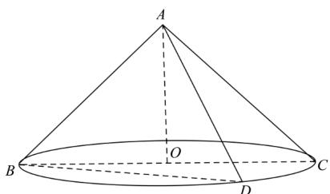

> [!faq]- 《第八章_立体几何初步_高效培优讲义_》官方解析
>
> > [!success]- **【答案】** $\left[2\sqrt{2},4\right)$
>
> > [!note]- **【分析】**
> > 依据题意作出圆锥的轴截面，再分析其轴截面三角形的顶角是否大于等于 $90^{\circ}$ ，结合三角函数即可得
> >
> > 解·
>
> > [!note]- **【解析】**
> > 如图 $\vee ABC$ 是圆锥的轴截面，设圆锥底面圆的半径为r·
> >
> > 若 $\angle BAC < 90^{\circ}$ ，所得截面面积的最大值为 $S_{\triangle ABC}$
> >
> > 则 $S_{\triangle ABC} = \frac{1}{2} AB\cdot AC\cdot \sin \angle BAC <   \frac{1}{2} AB\cdot AC = 8$ ，故不合题意；
> >
> > 若 $\angle BAC = 90^{\circ}$ ，此时所得截面面积的最大值为
> >
> > $S_{\triangle ABD}=\frac{1}{2}\times4\times4\times\sin90^{\circ}=8$ ，符合题意，
> >
> > 此时有 $\sin\angle OAB=\frac{r}{4}\quad\sin45^{\circ}$ ，解得 $r\quad2\sqrt{2}$ ，又 r<4，则 $r\in\left[2\sqrt{2},4\right)$ .
> >
> > 故答案为： $\left[2\sqrt{2},4\right)$ .
> >
> > 
