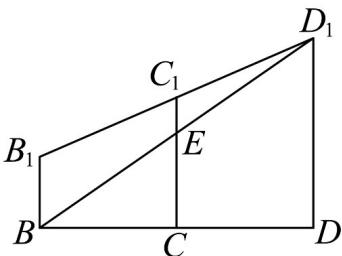

> [!faq]- 《第八章_立体几何初步_高效培优讲义_》官方解析
>
> > [!success]- **【答案】** 10
>
> > [!note]- **【分析】**
> > 根据对称性截面四边形 $B{ED}_{1}F$ 的周长的最小值，即 ${BE} + E{D}_{1}$ 取最小，再利用侧面展开图，当B
> >
> > $E$ ， $D_{1}$ 三点共线时， $BE + ED_{1}$ 最小即可求解·
>
> > [!note]- **【解析】**
> > 由题意，平面 $ADD_{1}A_{1}//$ 平面 $BCB_{1}C_{1}$
> >
> > 平面 $ADD_{1}A_{1}\cap$ 平面 $BED_{1} = D_{1}F$ ，平面 $BCB_{1}C_{1}\cap$ 平面 $BED_{1} = BE$
> >
> > 所以 $D_{1}F / / BE$ ，同理可得 $BF / / D_{1}E$
> >
> > 所以四边形 $BED_{1}F$ 为平行四边形，则周长 $l = 2(BE + ED_{1})$ ，沿 $CC_{1}$ 将右面和后面相邻两面展开，
> >
> > 当 $B, E, D_{1}$ 三点共线时， $BE + ED_{1}$ 最小，最小值为 $\sqrt{BD^2 + DD_1^2} = \sqrt{(2 + 2)^2 + 3^2} = 5$
> >
> > 所以截面四边形 $BED_{1}F$ 的周长的最小值为 10.
> >
> > 
> >
> > 故答案为：10.
