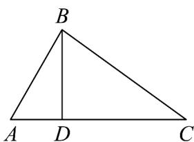

> [!faq]- 《专题01_平面向量的运算七大常考题型_高效培优专项训练_》官方解析
>
> > [!success]- **【答案】** $3 \sqrt{3}$
>
> > [!note]- **【解析】**
> > 设 $\overline{AD} = \lambda \overline{AC}$ ，则点 D 在直线 AC 上，
> >
> > 所以 $\left|AB-\lambda AC\right|=\left|AB-AD\right|=\left|DB\right|$
> >
> > 所以当 $BD \perp AC$ 时， $\left| \begin{array}{c} \square \\ DB \end{array} \right|$ 取得最小值，其最小值为 $AB \sin \angle BAC = 6 \times \frac{\sqrt{3}}{2} = 3\sqrt{3}$
> >
> > 即对 $\forall\lambda\in\mathbf{R},\left|\stackrel{\sqcup\sqcup\sqcup}{AB}-\lambda\stackrel{\sqcup\sqcup\sqcup}{AC}\right|$ 的最小值为 $3\sqrt{3}$ .
> >
> > 
> >
> > 故答案为： $3\sqrt{3}$
> >
> > 题型二：向量加减法的实际应用
