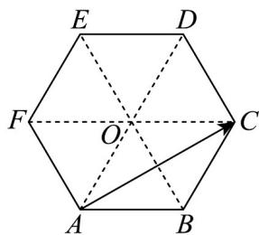

> [!faq]- 《专题01_平面向量的运算七大常考题型_高效培优专项训练_》官方解析
>
> > [!success]- **【答案】** A
>
> > [!note]- **【解析】**
> > 连接 AD 、 BE 、 CF 交于点 O ，如下图所示：
> >
> > 
> >
> > 由正六边形的几何性质可知 $^{\triangle}OAB$ 、 $\triangle OBC$ 、 $\triangle OCD$ 、 $\triangle ODE$ 、 $\triangle OEF$ 、 $\triangle OFA$ 均为等边三角形，因为OF = AF = AB = OB，故四边形ABOF为菱形，
> >
> > 同理可知，四边形 $ABCO$ 也为菱形，所以 $FO = AB = OC$ ，故 $FC = 2AB$
> >
> > 故 $AC = AF + FC = AF + 2AB$
> >
> > 故选 **A**.
