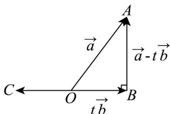

> [!faq]- 《专题01_平面向量的运算七大常考题型_高效培优专项训练_》官方解析
>
> > [!success]- **【答案】** D
>
> > [!note]- **【解析】**
> > $\left|a-tb\right|$ 的几何意义如图所示，
> >
> > 因为 $\left|a-tb\right|$ 的最小值为3，
> >
> > 所以在 Rt△AOB 中， $|OA|=2\sqrt{3},|AB|=3$ ，所以 $\sin\Phi AOB=\frac{3}{2\sqrt{3}}=\frac{\sqrt{3}}{2}$ ，
> >
> > 所以 $\angle AOB = \frac{\pi}{3}$
> >
> > 因为 $tb$ 与 $a$ 的夹角有两种情况，即 $q = < OA, OB>$ 或 $q = < OA, OC>$ ，所以 $\theta = \frac{\pi}{3}$ 或 $\frac{2\pi}{3}$ ，
> >
> > 故选：D.
> >
> > 
