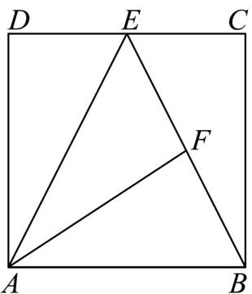

> [!faq]- 《专题01_平面向量的运算七大常考题型_高效培优专项训练_》官方解析
>
> > [!success]- **【答案】** B
>
> > [!note]- **【解析】**
> > 依题意， $\overline{AF}=\frac{1}{2}\left(\overline{AB}+\overline{AE}\right)=\frac{1}{2}\overline{AB}+\frac{1}{2}\overline{AE}$ $=\frac{1}{2}\overline{AB}+\frac{1}{2}\left(\overline{AD}+\overline{DE}\right)=\frac{1}{2}\overline{AB}+\frac{1}{2}\left(\overline{AD}+\frac{1}{2}\overline{AB}\right)=\frac{3}{4}\overline{AB}+\frac{1}{2}\overline{AD}$
> >
> > 故选：B
> >
> > 
