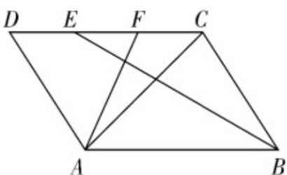

> [!faq]- 《专题01_平面向量的运算七大常考题型_高效培优专项训练_》官方解析
>
> > [!success]- **【答案】**  A. $EF = \frac{1}{3} AB$ B. $AF = \frac{1}{3} AD + \frac{2}{3} AC$ C. $BE = CB - CE$ D. $AD + DC = AB + BC$
>
> > [!note]- **【解析】**
> > 对于 $^{A}$ ，由题意知，E，F分别是CD边上的两个三等分点，且 $\frac{1}{EF}$ 与 $\frac{1}{AB}$ 方向相同，则 $EF=\frac{1}{3}AB$
> >
> > 故 $^{A}$ 正确；
> >
> > 对于 B， $\overline{AF}=\overline{AD}+\overline{DF}=\overline{AD}+\frac{2}{3}\overline{DC}=\overline{AD}+\frac{2}{3}\left(\overline{AC}-\overline{AD}\right)=\frac{1}{3}\overline{AD}+\frac{2}{3}\overline{AC}$ ，故 B 正确；
> >
> > 对于 C， $CB-CE=EB$ ，故 C 错误；
> >
> > 对于 D， $AD + DC = AC, AB + BC = AC$ ，所以 $AD + DC = AB + BC$ ，故 D 正确。
> >
> > 故选 **ABD**.
