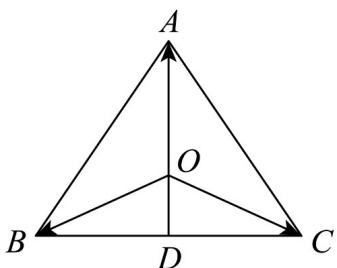

> [!faq]- 《专题01_平面向量的运算七大常考题型_高效培优专项训练_》官方解析
>
> > [!success]- **【答案】** A. 等腰直角三角形 B. 等腰三角形 C. 等边三角形 D. 直角三角形
>
> > [!note]- **【解析】**
> > 如图，点 $D$ 是 $BC$ 的中点，所以 $\overline{OB} +\overline{OC} = 2\overline{OD}$
> >
> > 因为 $OA + OB + OC = 0$ ，即 $OA + 2OD = 0$ ，即 $OA = -2OD$ ，
> >
> > 则点 A, O, D 三点共线，且 $\left|OA\right|=2\left|OD\right|$ ，所以点 O 是 VABC 的重心，
> >
> > 又 $\left|\overline{OA}\right|=\left|\overline{OB}\right|=\left|\overline{OC}\right|$ ，所以点O是VABC的外心，则 $OD\perp BC$ ，即 $AD\perp BC$ ，
> >
> > 所以 AB = AC ，同理 CA = CB ，则 AB = BC = CA ，
> >
> > 
> >
> > 所以 VABC 是等边三角形.
> >
> > 故选 **C**
