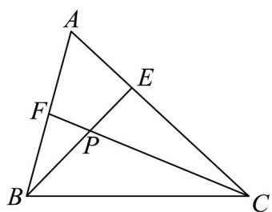

<!-- question-source:start -->
1. 如图，在 $\mathrm{V}ABC$ 中， $E$ ， $F$ 分别为边 $AC$ ， $AB$ 上的点，若 $AB = 2AF$ ， $AC = 3AE$ ，则 $\frac{BP}{PE} \cdot \frac{CP}{PF} =$

<!-- question-source:end -->

![[高中/课堂同步/题库/人教A版高中数学同步讲义(2026)/02_必修第二册/第六章 平面向量及其应用/专项训练/专题02_平面向量基本定理及坐标表示六大常考题型_高效培优专项训练_/题型一_sec_02/questions/answers/Q00065430A1.md]]
