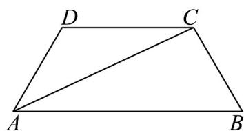

<!-- question-source:start -->
8. 如图，在梯形 $ABCD$ 中， $AB // CD$ ，且 $AB = 2CD$ ，设 $AD = a$ ， $BC = b$

(1)试用 a 和 b 表示 $AC$ ;

(2)若点 $P$ 满足 $\overrightarrow{AP} = \frac{3}{4}\overrightarrow{a} +\overrightarrow{\lambda b}$ ，且 $B,D,P$ 三点共线，求实数 $\lambda$ 的值.

(3)若 $AD = 2$ ， $AB = 4$ ， $\angle DAB = 60^{\circ}$ ，且点 $E$ 是线段 $AC$ 上的动点，求 $\overline{DE} \cdot \overline{BE}$ 的最小值
<!-- question-source:end -->

![[高中/课堂同步/题库/人教A版高中数学同步讲义(2026)/02_必修第二册/第六章 平面向量及其应用/专项训练/专题02_平面向量基本定理及坐标表示六大常考题型_高效培优专项训练_/题型一_sec_02/questions/answers/Q00065437A1.md]]
