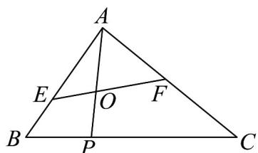

<!-- question-source:start -->
9. 如图，在 $\mathrm{VABC}$ 中， $P$ 为线段 $BC$ 上靠近点 $B$ 的三等分点， $O$ 是线段 $AP$ 上一点，过点 $O$ 的直线与边 $AB, AC$ 分别交于点 $E, F$ ，设 $AE = \lambda AB, AF = \mu AC$ .

(1)以 $\left\{AB,AC\right\}$ 为基底表示AP.

(2)若 $\lambda = \frac{1}{3},\mu = \frac{1}{2}$ ，求 $\frac{AO}{AP}$ 的值；

(3)若点 O 为线段 AP 的中点，求 $\lambda + \mu$ 的最小值.
<!-- question-source:end -->

![[高中/课堂同步/题库/人教A版高中数学同步讲义(2026)/02_必修第二册/第六章 平面向量及其应用/专项训练/专题02_平面向量基本定理及坐标表示六大常考题型_高效培优专项训练_/题型一_sec_02/questions/answers/Q00065438A1.md]]
