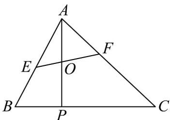

<!-- question-source:start -->
10. 如图，在VABC中，点P满足 $PC = 2BP$ ，O是线段AP的中点，过点O的直线与线段AB, AC分别交

于点 $E,F$

(1)若 $\overline{AE}=\frac{2}{3}\overline{AB}$ ，请用向量 $\overline{AB},\overline{AC}$ 来表示向量 $\overline{AO},\overline{EO}$ ；

(2)若 $AE = \lambda AB(0\leq \lambda \leq 1),\overline{AF} = \mu AC(0\leq \mu \leq 1)$ ，求 $2\lambda +\mu$ 的最小值.
<!-- question-source:end -->

![[高中/课堂同步/题库/人教A版高中数学同步讲义(2026)/02_必修第二册/第六章 平面向量及其应用/专项训练/专题02_平面向量基本定理及坐标表示六大常考题型_高效培优专项训练_/题型一_sec_02/questions/answers/Q00065439A1.md]]
