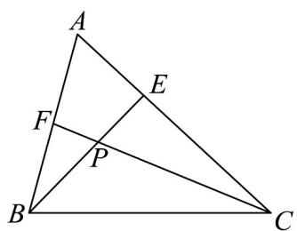

> [!faq]- 《专题02_平面向量基本定理及坐标表示六大常考题型_高效培优专项训练_》官方解析
>
> > [!success]- **【答案】** 6
>
> > [!note]- **【解析】**
> > 
> >
> > 由已知 $AC = 3AE$ 可得： $\overline{AC} = 3\overline{AE}\Rightarrow \overline{BC} -\overline{BA} = 3\left(\overline{BE} -\overline{BA}\right)$
> >
> > 所以 $\frac{1}{3} \frac{1}{3} BC + \frac{2}{3} BA$ ，设 $BP = \lambda BE$ ，则 $\frac{1}{3} \frac{1}{3} \lambda BC + \frac{2}{3} \lambda BA$ ，因为 $AB = 2AF$ ，所以 $\frac{\square\square\square}{BA} = \frac{\square\square\square}{2BF}$ ，即 $\frac{\square\square\square}{BP} = \frac{1}{3}\lambda \frac{\square\square\square}{BC} +\frac{4}{3}\lambda \frac{\square\square\square}{BF}$ 因为 $F,P,C$ 三点共线，所以 $\frac{1}{3}\lambda +\frac{4}{3}\lambda = 1\Rightarrow \lambda = \frac{3}{5}$ 即 $\frac{\square\square\square}{BP} = \frac{3}{5}\frac{\square\square\square}{BE}$ ，所以 $\frac{BP}{PE} = \frac{3}{2}$ 把 $\lambda = \frac{3}{5}$ 代入 $BP = \frac{1}{3}\lambda BC + \frac{4}{3}\lambda BF$ 可得： $BP = \frac{1}{5} BC + \frac{4}{5} BF\Rightarrow 5BP = BC + 4BF$ $\Rightarrow 4BP - 4BF = BC - BP\Rightarrow 4BP - 4BF = BC - BP\Rightarrow 4FP = PC$ 即 $\frac{CP}{PF} = 4$ ，所以 $\frac{BP}{PE}\cdot \frac{CP}{PF} = \frac{3}{2}\times 4 = 6$
> >
> > ## 故答案为：6
