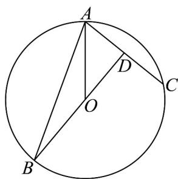

> [!faq]- 《专题02_平面向量基本定理及坐标表示六大常考题型_高效培优专项训练_》官方解析
>
> > [!success]- **【答案】** B
>
> > [!note]- **【解析】**
> > 当 $AO$ 与 $AC$ 不共线时，如图设 $AC$ 中点为 $D$ ，由 $AO = xAB + yAC = xAB + 2yAD$ 因 $x + 2y = 1$ ，则 $B, O, D$ 三点共线，由圆的性质知 $OD \perp AC$ 故 $\cos \angle BAC = \frac{AD}{AB} = \frac{2}{6} = \frac{1}{3}$ .
> >
> > 当 $\overset{\square\square}{AO}$ 与 $\overset{\square\square}{AC}$ 共线时，由 $\overset{\square\square}{AO}=xAB+yAC$ 和 $x+2y=1$ 可得 x=0, $y=\frac{1}{2}$ ,
> >
> > 但此时 AC 是圆的直径，则 AC > AB，与题设不符。
> >
> > 综上，可得 $\cos \angle BAC = \frac{1}{3}$ 故选：B
> >
> > 
