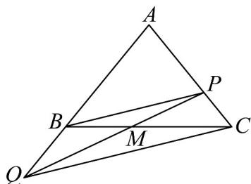

> [!faq]- 《专题02_平面向量基本定理及坐标表示六大常考题型_高效培优专项训练_》官方解析
>
> > [!success]- **【答案】** A. $PB//CQ$ B. $AQ\cdot AP=8$ C. $QA\cdot QB<0$ D. $CM=\frac{1}{5}CA+\frac{2}{5}CQ$
>
> > [!note]- **【解析】**
> > 由 $PA+2PC=0$ ，及 $QA=3QB$ ，得如图所示：
> >
> > 
> >
> > 则 $\frac{|AB|}{|BQ|} = \frac{|AP|}{|PC|} = \frac{2}{1}$ ，得 $PB / / CQ$ ，故A项正确；
> >
> > 由 $\frac{|AQ|}{|AB|}=\frac{3}{2},\frac{|AP|}{|AC|}=\frac{2}{3}$ ，则 $AQ \cdot AP = \frac{3}{2} AB \cdot \frac{2}{3} AC = AB \cdot AC = 8$ ，故 B 项正确；
> >
> > 由 $\overline{QA}$ 与 $\overline{QB}$ 是同向共线的，故 $\overline{QA} \cdot \overline{QB} > 0$ ，故 $^{C}$ 项错误；
> >
> > $$
> > C M = \frac {3}{5} C B = \frac {3}{5} \left(C A + A B\right)
> > $$
> >
> > $= \frac{3}{5} \overline{CA} + \frac{3}{5} \times \frac{2}{3} \overline{AQ} = \frac{3}{5} \overline{CA} + \frac{2}{5} (\overline{CQ} - \overline{CA}) = \frac{1}{5} \overline{CA} + \frac{2}{5} \overline{CQ}$ 故D项正确.
> >
> > 故选 **ABD**
