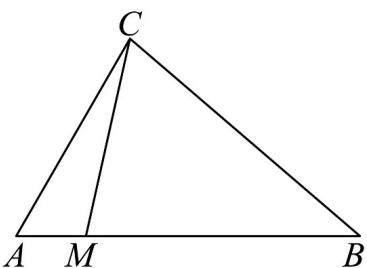

> [!faq]- 《专题02_平面向量基本定理及坐标表示六大常考题型_高效培优专项训练_》官方解析
>
> > [!success]- **【答案】**  A. $m = \frac{3}{4}$ ， $n = \frac{1}{4}$ B. $m = \frac{4}{5}$ ， $n = \frac{1}{5}$ C. $m = \frac{1}{5}$ ， $n = \frac{4}{5}$ D. $m = \frac{1}{4}$ ， $n = \frac{3}{4}$
>
> > [!note]- **【解析】**
> > 因为 $BM = 4MA$
> >
> > 所以 $AM = \frac{1}{5} AB$
> >
> > 则 $\overline{CM} = \overline{CA} + \overline{AM} = \overline{CA} + \frac{1}{5}\overline{AB} = \overline{CA} + \frac{1}{5}\left(\overline{CB} - \overline{CA}\right) = \frac{4}{5}\overline{CA} + \frac{1}{5}\overline{CB}$
> >
> > 故 $m = \frac{4}{5}$ ， $n = \frac{1}{5}$
> >
> > 故选 **B**.
