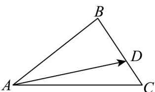

> [!faq]- 《专题02_平面向量基本定理及坐标表示六大常考题型_高效培优专项训练_》官方解析
>
> > [!success]- **【答案】** C
>
> > [!note]- **【解析】**
> > 如图，由 $2BD = 3CD$ 可得 $\overline{BD} = \frac{3}{5}\overline{BC}$
> >
> > 
> >
> > 则 $AD = AB + BD = AB + \frac{3}{5} BC = AB + \frac{3}{5}\left(AC - AB\right) = \frac{2}{5} AB + \frac{3}{5} AC.$
> >
> > 故选 **C**
