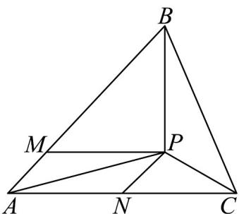

> [!faq]- 《专题02_平面向量基本定理及坐标表示六大常考题型_高效培优专项训练_》官方解析
>
> > [!success]- **【答案】** 4
>
> > [!note]- **【解析】**
> > 法一：设 $\frac{AM}{4} = \frac{1}{4} AB$ ， $AN = \frac{1}{2} AC$ ，以 AM, AN 为邻边作平行四边形 AMPN，
> >
> > 如图，则 $S_{\triangle AMP} = \frac{1}{4} S_{\triangle ABP}$ ， $S_{\triangle ANP} = \frac{1}{2} S_{\triangle APC}$
> >
> > 
> >
> > 因为 $S_{\triangle AMP} = S_{\triangle ANP}$ ，所以 $S_{\triangle PAB} = 2S_{\triangle PAC} = 4$
> >
> > 法二：因为 $AP = \frac{1}{4} AB + \frac{1}{2} AC$
> >
> > 所以 $4AP = AP + PB + 2AP + 2PC$ ，所以 $\overline{PA} +\overline{PB} +\overline{PC} = 0$
> >
> > 所以 $S_{\triangle PBC}: S_{\triangle PAC}: S_{\triangle PAB} = 1:1:2$
> >
> > 所以 $S_{\triangle PAB} = 2S_{\triangle PAC} = 4$
> >
> > 故答案为：4
