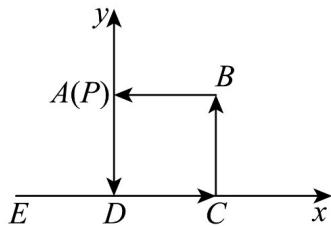

> [!faq]- 《专题02_平面向量基本定理及坐标表示六大常考题型_高效培优专项训练_》官方解析
>
> > [!success]- **【答案】** $(5,-6)$
>
> > [!note]- **【解析】**
> > 点 $A(2,3)$ ， $B(4,-3)$ ，点 P 在线段 AB 的延长线上，且 $\frac{|AP|}{|PB|}=3$ ，
> >
> > 设点 P 的坐标为 $(x,y)$ ，则 $\overline{AP} = (x - 2, y - 3)$ ， $\overline{PB} = (4 - x, -3 - y)$ ，且 $\overline{AP} = -3\overline{PB}$ ，
> >
> > 即 $\left\{\begin{aligned}x-2&=-3(4-x)\\ y-3&=-3(-3-y)\end{aligned}\right.$ ，解得 $\left\{\begin{aligned}x&=5\\ y&=-6\end{aligned}\right.$
> >
> > 所以点 $P$ 为 $(5, -6)$
> >
> > 故答案为： $(5, - 6)$
> >
> > 15. 延长正方形 $ABCD$ 的边 $CD$ 至点 $E$ ，使 $DE = CD$ ，动点 $P$ 从点 $A$ 出发沿正方形的边按逆时针方向运动一周后回到点 $A$ ，若 $\overline{AP} = I\overline{AB} + m\overline{AE}$ ，则下列正确的是（）
> >
> > 【答案】
> > A．若 $\lambda = \mu = 1$ ，则点 $P$ 与点 $D$ 重合
> > B．若点 $P$ 与点 $C$ 重合，则 $\lambda = 1$ ， $\mu = 2$ C．满足 $\lambda + \mu = 1$ 的点 $P$ 有 2 个
> > D．满足 $\lambda + \mu = \frac{3}{2}$ 的点 $P$ 有且只有 1 个
> >
> > 【答案】AC
> >
> > 【详解】选项A：已知 $AE = AD + DE$ ， $DE = CD = BA$ ，即 $AE = AD + BA$ ，若 $\lambda = \mu = 1$ ，则 $AP = AB + AE = AB + AD + BA = AD$ ，故点 $P$ 与点 $D$ 重合，选项A正确；
> > 选项B：若点 $P$ 与点 $C$ 重合，则 $AP = AC = AB + AD = AB + (AE - BA) = 2AB + AE$ 故 $\lambda = 2$ ， $\mu = 1$ ，选项B错误；
> > 选项C：以 $D$ 为原点， $DA,DC$ 为 $x,y$ 轴建立平面直角坐标系， $A(0,1)$ ， $B(1,1)$ ， $E(-1,0)$ ，若 $\lambda +\mu = 1$ ，则 $\mu = 1 - \lambda$ ， $AP = \lambda AB + \mu AE = \lambda (1,0) + (1 - \lambda)(-1, - 1) = (2\lambda -1,\lambda -1)$ ， $P(2\lambda -1,\lambda)$ ，当 $P$ 在 $AB$ 上时， $y = 1$ ，解得 $\lambda = 1$ ， $P(1,1)$ 为 $B$ 点，当 $P$ 在 $BC$ 上时， $x = 1$ ，解得 $\lambda = 1$ ， $P(1,1)$ ，为 $B$ 点，当 $P$ 在 $CD$ 上时， $y = 0$ ，解得 $\lambda = 0$ ， $P(-1,0)$ ，不符合题意，当 $P$ 在 $AD$ 上时， $x = 0$ ，解得 $\lambda = \frac{1}{2}$ ， $P(0,\frac{1}{2})$ 综上，满足 $\lambda +\mu = 1$ 的点 $P$ 有2个，一个是 $B$ 点，一个是 $(0,\frac{1}{2})$ ，选项C正确；选项D：若 $\lambda +\mu = \frac{3}{2}$ ，则 $\mu = \frac{3}{2} -\lambda$ ， $AP = \lambda AB + \mu AE = \lambda (1,0) + (\frac{3}{2} -\lambda)(-1, - 1) = (2\lambda -\frac{3}{2},\lambda -\frac{3}{2})$ ， $P(2\lambda -\frac{3}{2},\lambda -\frac{1}{2})$ ，当 $P$ 在 $AB$ 上时， $y = 1$ ，解得 $\lambda = \frac{3}{2}$ ， $P(\frac{3}{2},1)$ ，不符合题意，
> >
> > 当 $P$ 在 $BC$ 上时， $x = 1$ ，解得 $\lambda = \frac{5}{4}$ ， $P(1, \frac{3}{4})$ ，
> >
> > 当 $P$ 在 $CD$ 上时， $y = 0$ ，解得 $\lambda = \frac{1}{2}$ ， $P(-\frac{1}{2}, 0)$ ，不符合题意，
> >
> > 当 $P$ 在 $AD$ 上时， $x = 0$ ，解得 $\lambda = \frac{3}{4}$ ， $P(0, \frac{1}{4})$ ，综
> >
> > 上，满足 $\lambda +\mu = \frac{3}{2}$ 的点 $P$ 有2个，一个是 $P(1,\frac{3}{4})$ ，一个是 $(0,\frac{1}{4})$ ，选项D错误
> >
> > 故选：AC.
> >
> > 
