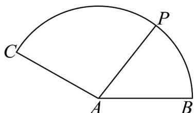
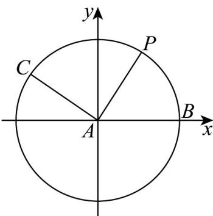

> [!faq]- 《专题02_平面向量基本定理及坐标表示六大常考题型_高效培优专项训练_》官方解析
>
> > [!success]- **【答案】**  A.2 B. $\sqrt{3}$ C.0 D.-1
>
> > [!note]- **【解析】**
> > 以 AB 所在直线为 x 轴，A 为坐标原点，建立如图所示直角坐标系：
> >
> > 
> >
> > 设 $\angle PAB = \alpha$ ，则根据三角函数定义， $P(\cos \alpha ,\sin \alpha)$ ，且 $\alpha \in [0^{\circ},150^{\circ}]$
> >
> > 同时 $A(0,0), B(1,0), C\left(-\frac{\sqrt{3}}{2}, \frac{1}{2}\right)$ ，由 $\overline{AP} = \overline{\lambda AB} + \overline{\mu AC}$ 可得：
> >
> > $\left(\cos \alpha, \sin \alpha\right) = \lambda (1, 0) + \mu \left(-\frac{\sqrt{3}}{2}, \frac{1}{2}\right)$ ，也即 $\cos \alpha = \lambda - \frac{\sqrt{3}}{2} \mu$ ， $\sin \alpha = \frac{1}{2} \mu$
> >
> > 则 $\mu = 2\sin \alpha$ ， $\lambda = \sqrt{3}\sin \alpha +\cos \alpha$
> >
> > 则 $\sqrt{3}\lambda -\mu = 3\sin \alpha +\sqrt{3}\cos \alpha -2\sin \alpha = \sin \alpha +\sqrt{3}\cos \alpha = 2\sin (\alpha +60^{\circ})$ ， $\alpha \in [0^{\circ},150^{\circ}]$
> >
> > 则 $\alpha + 60^{\circ} \in [60^{\circ}, 210^{\circ}]$ ， $\sin (\alpha + 60^{\circ}) \in \left[-\frac{1}{2}, 1\right]$ ，故 $2\sin (\alpha + 60^{\circ}) \in [-1, 2]$ ，
> >
> > 也即 $\sqrt{3}\lambda - \mu$ 的最大值为 $2\cdot$
> >
> > 故选 **A**.
