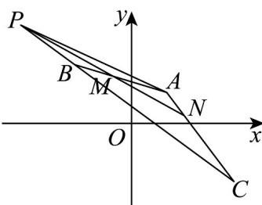

> [!faq]- 《专题02_平面向量基本定理及坐标表示六大常考题型_高效培优专项训练_》官方解析
>
> > [!success]- **【答案】** $\left(-4, \frac{14}{5}\right)$
>
> > [!note]- **【解析】**
> > 由题知， $AB = (-3,2),AC = (2, - 2)$
> >
> > $AM=\frac{2}{3}AB,AN=\frac{1}{4}AC$ ，则 $M\left(-1,\frac{7}{3}\right),N\left(\frac{3}{2},\frac{1}{2}\right)$
> >
> > 由 $P, B, C$ 三点共线设 $\overline{PB} = \lambda \overline{BC} = (5\lambda, -4\lambda)$ ，则 $P(-2 - 5\lambda, 3 + 4\lambda)$
> >
> > 所以 $\overline{PM}=\left(5\lambda+1,-4\lambda-\frac{2}{3}\right)$ ， $\overline{PN}=\left(5\lambda+\frac{7}{2},-4\lambda-\frac{5}{2}\right)$
> >
> > 因为点 $P, M, N$ 三点共线，所以 $\overline{PN} //PM$
> >
> > 则 $\left(5\lambda + 1\right)\left(-4\lambda - \frac{5}{2}\right) = \left(-4\lambda - \frac{2}{3}\right)\left(5\lambda + \frac{7}{2}\right)$ ，解得 $\lambda = \frac{1}{5}$
> >
> > 所以 $P\left(-3, \frac{19}{5}\right)$ ，则 $AP = \left(-4, \frac{14}{5}\right)$
> >
> > 故答案为： $\left(-4, \frac{14}{5}\right)$
> >
> > 
