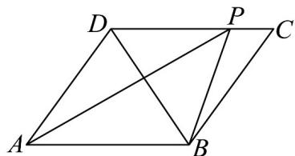

<!-- question-source:start -->
59. 如图，已知菱形 $ABCD$ 中，点 $P$ 为线段 $CD$ 上一点，且 $\overline{CP} = \lambda \overline{CD}\left(0 \leq \lambda \leq 1\right)$

(1)若 $\lambda = \frac{1}{3}$ ， $AP = xBC + yBD$ ，求 $x, y$ 的值；

(2)若 $BD = BC$ ，且 $\overline{BP} \cdot \overline{CD}$ $\overline{PC} \cdot \overline{PD}$ ，求实数 $\lambda$ 的取值范围.
<!-- question-source:end -->

![[高中/课堂同步/题库/人教A版高中数学同步讲义(2026)/02_必修第二册/第六章 平面向量及其应用/专项训练/专题02_平面向量基本定理及坐标表示六大常考题型_高效培优专项训练_/题型六_sec_07/questions/answers/Q00065487A1.md]]
