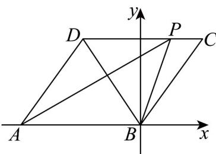

> [!faq]- 《专题02_平面向量基本定理及坐标表示六大常考题型_高效培优专项训练_》官方解析
>
> > [!success]- **【答案】** (1) $x=\frac{5}{3},y=-\frac{2}{3}$ (2) $\left[1 - \frac{\sqrt{2}}{2}, 1\right]$
>
> > [!note]- **【解析】**
> > （1）当 $\lambda=\frac{1}{3}$ 时， $AP=AB+BC+CP=AB+AD+\frac{1}{3}CD=AB+AD-\frac{1}{3}AB=\frac{2}{3}AB+AD$
> >
> > 则 $AP = xBC + yBD = xAD + y\left( \overline{AD} - \overline{AB} \right) = -yAB + (x + y)\overline{AD}$
> >
> > 所以 $\left\{\begin{aligned}-y&=\frac{2}{3}\\ x+y&=1\end{aligned}\right.$ ，解得 $x=\frac{5}{3},y=-\frac{2}{3}$
> >
> > (2) 由四边形 ABCD 为菱形，BD = BC， $\triangle BCD$ 为等边三角形，
> >
> > 以 $B$ 为坐标原点，以 $AB$ 为 $x$ 轴建立如图所示平面直角坐标系，
> >
> > 设 $AB = 2$ ，则 $B(0,0),C(1,\sqrt{3}),D(-1,\sqrt{3}),P(1 - 2\lambda ,\sqrt{3})$
> >
> > 则 $BP = (1 - 2\lambda, \sqrt{3}), CD = (-2, 0), PC = (2\lambda, 0), PD = (-2 + 2\lambda, 0)$
> >
> > 则 $BP\cdot CD = -2(1 - 2\lambda),PC\cdot PD = 2\lambda (-2 + 2\lambda)$
> >
> > 由 $BP\cdot CD$ $PC\cdot PD$ ，可得 $-2(1 - 2\lambda)$ $2\lambda (-2 + 2\lambda)$
> >
> > 解得 $1 - \frac{\sqrt{2}}{2} \leq \lambda \leq 1 + \frac{\sqrt{2}}{2}$
> >
> > 又 $0 \leq \lambda \leq 1$ ，则 $1 - \frac{\sqrt{2}}{2} \leq \lambda \leq 1$ ，
> >
> > 即实数 $\lambda$ 的取值范围为 $\left[1 - \frac{\sqrt{2}}{2}, 1\right]$
> >
> > 
