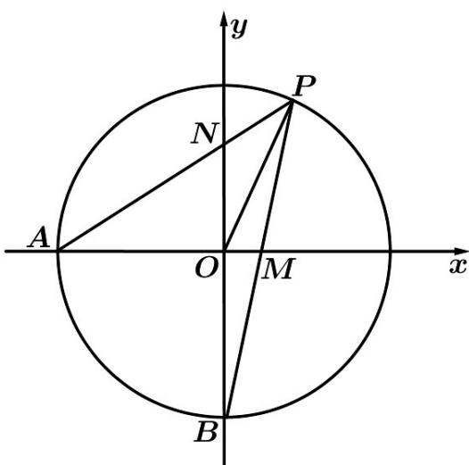

<!-- question-source:start -->
40．已知点 $A(-1,0)$ ， $B(0,-1)$ ， $P$ 为 $\theta\left(0 < \theta < \frac{\pi}{2}\right)$ 终边与单位圆的交点， $PA$ 与 $y$ 轴交于点 $N$ ， $PB$ 与 $x$ 轴交于点 $M$ ．

(1) 设 $PN = nPA$ ， $PM = mPB$ ，试用 $\theta$ 表示 m 与 n；

(2) 设 $PO = xPM + yPN(x, y \in R)$ ，试用 $\theta$ 表示 $x + y$ ，并求 $x + y$ 的最小值.
<!-- question-source:end -->

![[高中/课堂同步/题库/人教A版高中数学同步讲义(2026)/02_必修第二册/第六章 平面向量及其应用/专项训练/专题02_平面向量基本定理及坐标表示六大常考题型_高效培优专项训练_/题型四_sec_05/questions/answers/Q00065468A1.md]]
