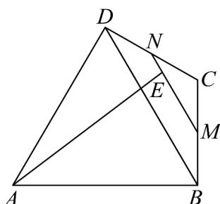
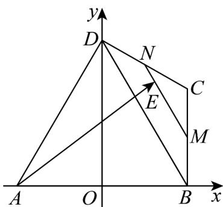

> [!faq]- 《专题02_平面向量基本定理及坐标表示六大常考题型_高效培优专项训练_》官方解析
>
> > [!success]- **【答案】** 
>
> > [!note]- **【解析】**
> > 以 AB 的中点 O 为坐标原点，以 AB 所在的直线为 x 轴，以 AB 的垂直平分线为 y 轴，建立平面直角坐标系，如图所示，设 $\left|AB\right|=2\sqrt{3}a$ ，
> >
> > 因为 $\angle BAD = 60^{\circ}, AD = AB$ ，可得 $\triangle ABD$ 为等边三角形，
> >
> > 又因为 $\angle BCD = 120^{\circ}, CB = CD$ ，可得 $\angle DBC = 30^{\circ}$ ，且 $BC = CD = 2a$ ，则 $BC \perp x$ 轴，
> >
> > 则 $A(-\sqrt{3} a,0),B(\sqrt{3} a,0),D(0,3a),C(\sqrt{3} a,2a)$ ，可得 $M(\sqrt{3} a,a),N(\frac{\sqrt{3}}{2} a,\frac{5}{2} a)$
> >
> > 设 $E(m,n)$ ，则 $\overline{AE} = (m + \sqrt{3} a,n),\overline{AB} = (2\sqrt{3} a,0),\overline{AD} = (\sqrt{3} a,3a)$
> >
> > 因为 $\overline{AE}=x\overline{AB}+y\overline{AD}$ ，可得 $(m+\sqrt{3}a,n)=x(2\sqrt{3}a,0)+y(\sqrt{3}a,3a)$ ，
> >
> > 则 $\left\{ \begin{array}{l} m + \sqrt{3} a = 2\sqrt{3} ax + \sqrt{3} ay \\ n = 3ay \end{array} \right.$ ，即 $\left\{ \begin{array}{l} m = 2\sqrt{3} ax + \sqrt{3} ay - \sqrt{3} a \\ n = 3ay \end{array} \right.$ ，
> >
> > 即 $E(2\sqrt{3} ax + \sqrt{3} ay - \sqrt{3} a, 3ay)$
> >
> > 又由 M, N 为 BC, CD 的中点，可得 BD // MN
> >
> > 因为 $k_{MN} = k_{BD} = -\sqrt{3}$ ，所以线段 MN 的方程为 $y - a = -\sqrt{3}(x - \sqrt{3}a)$ ，其中 $a \leq y \leq \frac{5a}{2}$ ，
> >
> > 将点 $E$ 代入线段 $MN$ 的方程，可得 $n - a = -\sqrt{3} (m - \sqrt{3} a)$
> >
> > 即 $3ay - a = -\sqrt{3} \cdot (2\sqrt{3}ax + \sqrt{3}ay - 2\sqrt{3}a)$ ，整理得 $x + y = \frac{7}{6}$ ，即 $x = \frac{7}{6} - y$ ，
> >
> > 因为点 $E(m,n)$ 在线段 $MN$ 上，可得 $a \leq 3ay \leq \frac{5a}{2}$ ，即 $\frac{1}{3} \leq y \leq \frac{5}{6}$ ，
> >
> > 又由 $xy = y\left(\frac{7}{6} -y\right) = -y^2 +\frac{7}{6} y = -(y - \frac{7}{12})^2 +\frac{49}{144}$ ，其中 $\frac{1}{3}\leq y\leq \frac{5}{6}$
> >
> > 当 $y = \frac{7}{12}$ 时， $xy$ 取得最大值，最大值为 $\frac{49}{144}$ ；
> >
> > 当 $y = \frac{1}{3}$ 或 $y = \frac{5}{6}$ 时， $xy$ 取得最小值，最小值为 $\frac{5}{18}$
> >
> > 所以 $xy$ 的取值范围为 $[\frac{5}{18},\frac{49}{144} ]$ ·故答案为： $[\frac{5}{18},\frac{49}{144} ]$
> >
> > 
