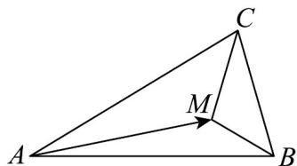

<!-- question-source:start -->
7. 如图，已知点 $M$ 是 $\mathrm{V}ABC$ 所在平面内一点，满足 $AM = \frac{2}{3} AB + \frac{1}{4} AC$ ，求 $\triangle ABM$ 与 $\triangle BCM$ 的面积之比。

<!-- question-source:end -->

![[高中/课堂同步/题库/人教A版高中数学同步讲义(2026)/02_必修第二册/第六章 平面向量及其应用/专项训练/专题03_平面向量的应用六大常考题型_高效培优专项训练_/题型一_sec_02/questions/answers/Q00065493A1.md]]
