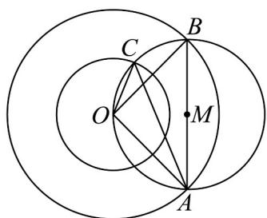

> [!faq]- 《专题03_平面向量的应用六大常考题型_高效培优专项训练_》官方解析
>
> > [!success]- **【答案】** $\left[\sqrt{7} - 1, \sqrt{7} + 1\right]$
>
> > [!note]- **【解析】**
> > 如图，设 $OA = a$ ， $OB = b$ ， $OC = c$
> >
> > 
> >
> > 由 $\left|a\right|=\left|b\right|=2,\left|c\right|=1$ ，点A,B在以O为圆心，半径为 $^{2}$ 的圆上运动，点C在以O为圆心，半径为 $^{1}$ 的圆上运动，
> >
> > 设 $AB$ 的中点为 $M$ ，因为 $(a - c)\cdot (b - c) = 0$ ，即 $CA\cdot CB = 0$
> >
> > 所以由极化恒等式可得 $\left|CM\right|=\left|BM\right|=\left|AM\right|$ ，证明如下：
> >
> > 令 $CM = x$ ， $MA = y$ ，则 $CA = CM + MA = x + y$ ， $CB = CM + MB = x - y$
> >
> > 所以 $\overline{CA} \cdot \overline{CB} = (x + y) \cdot (x - y) = (x)^{2} - (y)^{2} = 0$ ，解得 $|x| = |y|$ ，即 $|CM| = |BM| = |AM|$
> >
> > 即点 $C$ 在以 $AB$ 为直径的圆上，要求 $\left|a - b\right|$ ，即求直径 $\left|AB\right|$ 的取值范围，
> >
> > 不妨设圆 M 的半径为 r，因为点 C 所在的圆 O 与圆 M 存在公共点，
> >
> > 所以圆心距 $OM$ 满足： $\left|r - 1\right|\leq \left|OM\right|\leq \left|r + 1\right|$ ，且 $\left|OM\right| = \sqrt{4 - r^2}$
> >
> > 所以 $\left|r-1\right|\leq\sqrt{4-r^{2}}\leq\left|r+1\right|$ ，解得 $r\in\left[\frac{\sqrt{7}-1}{2},\frac{\sqrt{7}+1}{2}\right]$
> >
> > 所以 $\left|a-b\right|$ 的取值范围为 $\left[\sqrt{7}-1,\sqrt{7}+1\right]$
> >
> > 故答案为： $\left[\sqrt{7} -1,\sqrt{7} +1\right]$
