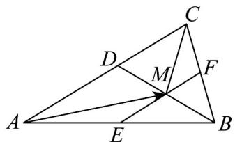
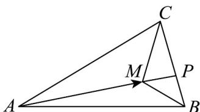

> [!faq]- 《专题03_平面向量的应用六大常考题型_高效培优专项训练_》官方解析
>
> > [!success]- **【答案】** $^{3}$
>
> > [!note]- **【解析】**
> > 法一：如图，过点 $M$ 作 $EF \parallel AC$ ，延长 $BM$ 交 $AC$ 于点 $D$ ，则 $\frac{S_{\triangle ABM}}{S_{\triangle BCM}} = \frac{EM}{FM}$
> >
> > 因为 $AM = \frac{2}{3} AB + \frac{1}{4} AC = AE + EM$
> >
> > 所以 $\frac{AE}{3} = \frac{2}{3} AB$ ，则 $EB = \frac{1}{3} AB$ ，所以 $EF = \frac{1}{3} AC$ ， $EM = \frac{1}{4} AC$ ，从而 $\frac{EM}{EF} = \frac{3}{4}$ ， $\frac{EM}{MF} = 3$
> >
> > 所以 $\frac{S_{\triangle ABM}}{S_{\triangle BCM}} = \frac{EM}{FM} = 3$
> >
> > 
> >
> > 法二：由 $\overline{AM}=\frac{2}{3}\overline{AB}+\frac{1}{4}\overline{AC}$ 得 $12\overline{AM}=8\left(\overline{AM}+\overline{MB}\right)+3\left(\overline{AM}+\overline{MC}\right)$ ，所以 $\overline{MA}+8\overline{MB}+3\overline{MC}=0$ ，以下证明结论：在平面内，若有 $\overline{MA} + x\overline{MB} + y\overline{MC} = 0$ ，其中 $M$ 是平面内一点， $A, B, C$ 是VABC的三个顶点，则 $S_{\triangle BCM}: S_{\triangle ACM}: S_{\triangle ABM} = 1: |x|: |y|$ .
> >
> > 由 $\overline{MA} + x\overline{MB} + y\overline{MC} = 0$ 可得 $\overline{MA} = -x\overline{MB} - y\overline{MC}$ ，
> >
> > 由向量叉乘的几何意义
> >
> > $$
> > S _ {\triangle A C M} = \frac {1}{2} \left| \begin{array}{l l} \square & \square \\ M A \times & M C \end{array} \right| = \frac {1}{2} \left| \left(- x M B - y M C\right) \times M C \right| = \frac {1}{2} \left| x M B \times M C \right| = x \cdot \frac {1}{2} \left| \begin{array}{l l} \square & \square \\ M B \times & M C \end{array} \right| = | x | S _ {\triangle B C M}
> > $$
> >
> > 同理可得 $S_{\triangle ABM} = |y| S_{\triangle BCM}$ ，所以 $S_{\triangle BCM}: S_{\triangle ACM}: S_{\triangle ABM} = 1: |x| : |y|$ .
> >
> > 利用以上结论，因为 $\overline{MA} + 8\overline{MB} + 3\overline{MC} = 0$ ，所以 $S_{\triangle BCM}: S_{\triangle ACM}: S_{\triangle ABM} = 1:8:3$ ，即 $\frac{S_{\triangle ABM}}{S_{\triangle BCM}} = 3$
> >
> > 法三：如图，延长 $AM$ 交 $BC$ 于点 $P$ ，设 $\overline{AM} = \lambda \overline{AP}$
> >
> > 因为 $\overline{AM} = \frac{2}{3}\overline{AB} +\frac{1}{4}\overline{AC}$ ，所以 $\lambda \overline{AP} = \frac{2}{3}\overline{AB} +\frac{1}{4}\overline{AC}$
> >
> > 又因为 $B, C, P$ 三点共线，所以 $\lambda = \frac{2}{3} + \frac{1}{4} = \frac{11}{12}$ ，即 $\frac{AM}{AP} = \frac{11}{12}$ ，
> >
> > 因为等高，所以 $\frac{S_{\triangle ABM}}{S_{\triangle PBM}} = \frac{AM}{MP} = \frac{11}{1}$ ，即 $S_{\triangle ABM} = 11S_{\triangle PBM}$
> >
> > 
> >
> > 因为 $AP = \frac{1}{\lambda}\left(\frac{2}{3} AB + \frac{1}{4} AC\right) = \frac{8}{11} AB + \frac{3}{11} AC$
> >
> > $\overline{BP}=\overline{BA}+\overline{AP}=-\frac{3}{11}\overline{AB}+\frac{3}{11}\overline{AC},\quad\overline{CP}=\overline{CA}+\overline{AP}=\frac{8}{11}\overline{AB}-\frac{8}{11}\overline{AC},$ 所以 $\frac{CP}{BP}=\frac{8}{3}$
> >
> > 因为等高，所以 $\frac{S_{\triangle BCM}}{S_{\triangle PBM}} = \frac{BC}{PB} = \frac{11}{3}$ ，即 $S_{\triangle BCM} = \frac{11}{3} S_{\triangle PBM}$ ，所以 $\frac{S_{\triangle ABM}}{S_{\triangle BCM}} = 3$
