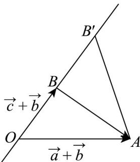

> [!faq]- 《专题03_平面向量的应用六大常考题型_高效培优专项训练_》官方解析
>
> > [!success]- **【答案】** A. $(a + b) \perp (a - c)$ B. $(a + b) \perp (b + c)$ C. $(a - c) \perp (a + b)$ D. $(a - c) \perp (b + c)$
>
> > [!note]- **【解析】**
> > $\left|a - tc + (1 - t)b\right| = \left|\left(a + b\right) - t(c + b)\right|\quad |a - c|$
> >
> > 如图，设 $a + b = OA$ ， $c + b = OB$ ， $t(c + b) = OB'$
> >
> > 则点 $B^{\prime}$ 在直线 $OB$ 上移动，且 $a - c = \overline{BA}$
> >
> > 
> >
> > 因为 $\left|\left(a+b\right)-t(c+b)\right|$ $\left|a-c\right|$
> >
> > 即 $\left|\overline{OA}-\overline{OB'}\right|=\left|\overline{B'A}\right|\quad\left|\overline{BA}\right|$
> >
> > 所以 $\left|^{UUU}BA\right|$ 是 $\left|^{UUU}B'A\right|$ 的最小值，故 $AB\perp OB'$ ，即 $(a-c)\perp(b+c)$ .
> >
> > 故选 **D**.
