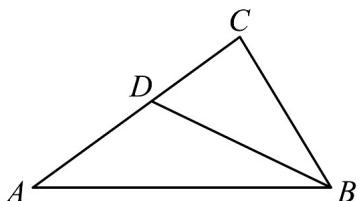

> [!faq]- 《专题03_平面向量的应用六大常考题型_高效培优专项训练_》官方解析
>
> > [!success]- **【答案】** （1）证明见解析；（2）最大值 $\frac{19}{12}$
>
> > [!note]- **【解析】**
> > （1）证明：设 $BC = 1$ ，则 $AB = \sqrt{3}$
> >
> > 在 $\triangle BCD$ 中，因为 $BC = CD = 1$ ，所以 $BD = 2\cos \theta$
> >
> > 在 $\triangle ABD$ 中，由余弦定理 $BD^{2} = AB^{2} + AD^{2} - 2AB\cdot AD\cos A$
> >
> > 即 $4\cos^2\theta = 3 + 1 - 2\sqrt{3}\cos A$
> >
> > 则 $2(1 - \cos^2\theta) = \sqrt{3}\cos A$ ，即 $2\sin^2\theta = \sqrt{3}\cos A$
> >
> > 故 $\frac{\cos A}{\sin^{2}\theta}=\frac{2\sqrt{3}}{3}$ 为定值.
> >
> > (2) 解：在 $\triangle BCD$ 中， $BD^{2}=BC^{2}+DC^{2}-2BC\cdot DC\cos C$
> >
> > 则 $4 - 2\sqrt{3}\cos A = 2 - 2\cos C$ ， $\cos C = \sqrt{3}\cos A - 1$
> >
> > $$
> > S = 2 S _ {1} ^ {2} + S _ {2} ^ {2} = 2 \left(\frac {\sqrt {3}}{2} \sin A\right) ^ {2} + \left(\frac {1}{2} \sin C\right) ^ {2}
> > $$
> >
> > $$
> > = \frac {3}{2} \sin^ {2} A + \frac {1}{4} \sin^ {2} C = \frac {3}{2} (1 - \cos^ {2} A) + \frac {1}{4} (1 - \cos^ {2} C) = \frac {3}{2} (1 - \cos^ {2} A) + \frac {1}{4} [ 1 - (\sqrt {3} \cos A - 1) ^ {2} ]
> > $$
> >
> > $$
> > = - \frac {9}{4} \left(\cos A - \frac {\sqrt {3}}{9}\right) ^ {2} + \frac {1 9}{1 2}
> > $$
> >
> > 当 $\cos A = \frac{\sqrt{3}}{9}$ 时， $S$ 取得最大值 $\frac{19}{12}$
> >
> > 30. VABC 中，内角 A, B, C 所对的边分别为 a, b, c·已知 $4a \sin A = b \sin C \cos A + c \sin A \cos B$ .
> >
> > (1)求 $\frac{\sin A}{\sin C}$ 的值；
> >
> > (2)若 $BD$ 是 $\angle ABC$ 的角平分线.
> >
> > (i) 证明： $BD^{2}=BA\cdot BC-DA\cdot DC$
> >
> > (ii) 若 $a = 1$ ，求 $BD \cdot AC$ 的最大值.
> >
> > 【答案】(1) $\frac{1}{2}$
> >
> > (2) (i) 证明见解析；(ii) $\frac{3\sqrt{2}}{2}$
> >
> > 【详解】（1）因为VABC中， $4a\sin A=b\sin C\cos A+c\sin A\cos B$
> >
> > 故 $4\sin^2 A = \sin B\sin C\cos A + \sin C\sin A\cos B = \sin C(\sin B\cos A + \sin A\cos B)$
> >
> > $= \sin C\sin (A + B) = \sin^2 C$
> >
> > 因为 $A, C \in (0, \pi), \therefore \sin A, \sin C > 0$ ，故 $\frac{\sin A}{\sin C} = \frac{1}{2}$ ;
> >
> > (2) (i) 证明： $\triangle ABD$ 中，由正弦定理得 $\frac{AD}{\sin \angle ABD} = \frac{AB}{\sin \angle ADB}$ ①，
> >
> > 
> >
> > 又 $AB^{2}=AD^{2}+BD^{2}-2AD\cdot BD\cdot\cos\angle ADB$ ②，
> >
> > 同理在 $\triangle BCD$ 中， $\frac{CD}{\sin\angle CBD}=\frac{BC}{\sin\angle CDB}$ ③，
> >
> > $$
> > B C ^ {2} = C D ^ {2} + B D ^ {2} - 2 C D \cdot B D \cdot \cos \angle C D B \tag {4}
> > $$
> >
> > BD 是 $\angle ABC$ 的角平分线，则 $\angle ABD = \angle CBD$
> >
> > 则 $\sin \angle ABD = \sin \angle CBD$
> >
> > 又 $\angle ADB + \angle CDB = \pi$ ，故 $\sin \angle ADB = \sin \angle CDB, \cos \angle ADB + \cos \angle CDB = 0$
> >
> > 故①÷③得 $\frac{AD}{CD}=\frac{AB}{BC}$ ⑤，即 $\frac{AD}{AC}=\frac{AB}{AB+BC},\therefore\frac{CD}{AC}=\frac{BC}{AB+BC}$
> >
> > 由 $CD \times ② + AD \times ④$ 得， $CD \cdot AB^2 + AD \cdot BC^2 = CD \cdot AD(AD + CD) + (CD + AD) \cdot BD^2$
> >
> > $$
> > = C D \cdot A D \cdot A C + A C \cdot B D ^ {2}
> > $$
> >
> > 则 $BD^{2} = \frac{CD\cdot AB^{2} + AD\cdot BC^{2}}{AC} - CD\cdot AD$
> >
> > $$
> > = \frac {B C \cdot A B ^ {2} + A B \cdot B C ^ {2}}{A B + B C} - C D \cdot A D = B A \cdot B C - D A \cdot D C
> > $$
> >
> > 即 $BD^{2}=BA\cdot BC-DA\cdot DC$ ；
> >
> > (ii) 因为 $\frac{\sin A}{\sin C} = \frac{1}{2}$ ，故 c = 2a，
> >
> > 则由⑤得 $\frac{AD}{CD} = \frac{AB}{BC} = 2$ ，则 $AD = \frac{2}{3} AC, DC = \frac{1}{3} AC$
> >
> > 由 $a = 1$ 以及（i）知 $BD^{2} = 2 - \frac{2}{9} AC^{2}$
> >
> > 即 $BD^{2}+\frac{2}{9}AC^{2}=2$ ，则 $BD^{2}+\frac{2}{9}AC^{2}\quad\frac{2\sqrt{2}}{3}BD\cdot AC$ ，当且仅当 $BD^{2} = \frac{2}{9} AC^{2}$ ，结合 $BD^{2} + \frac{2}{9} AC^{2} = 2$ ，即 $BD = 1, AC = \frac{3\sqrt{2}}{2}$ 时等号成立，故 $BD \cdot AC \leq \frac{3\sqrt{2}}{2}$ ，即 $BD \cdot AC$ 的最大值为 $\frac{3\sqrt{2}}{2}$ .
